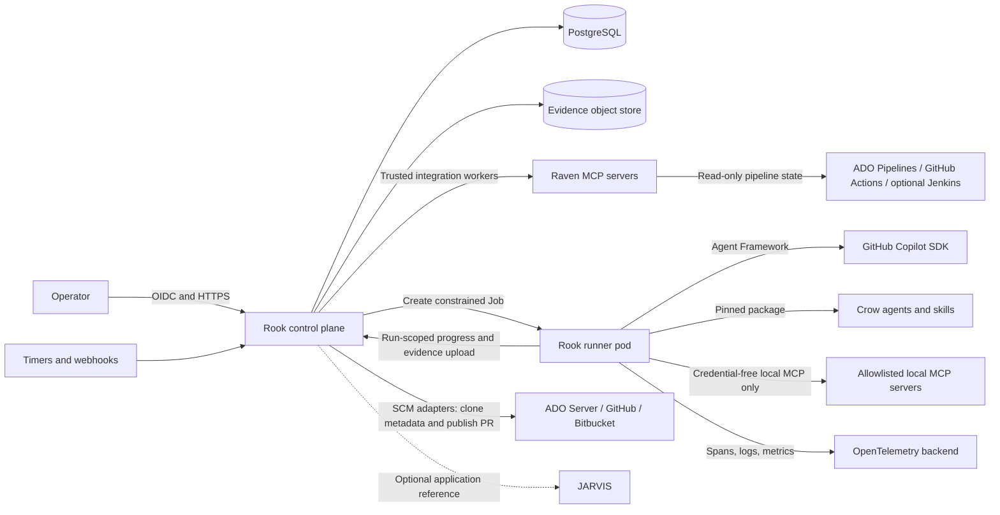
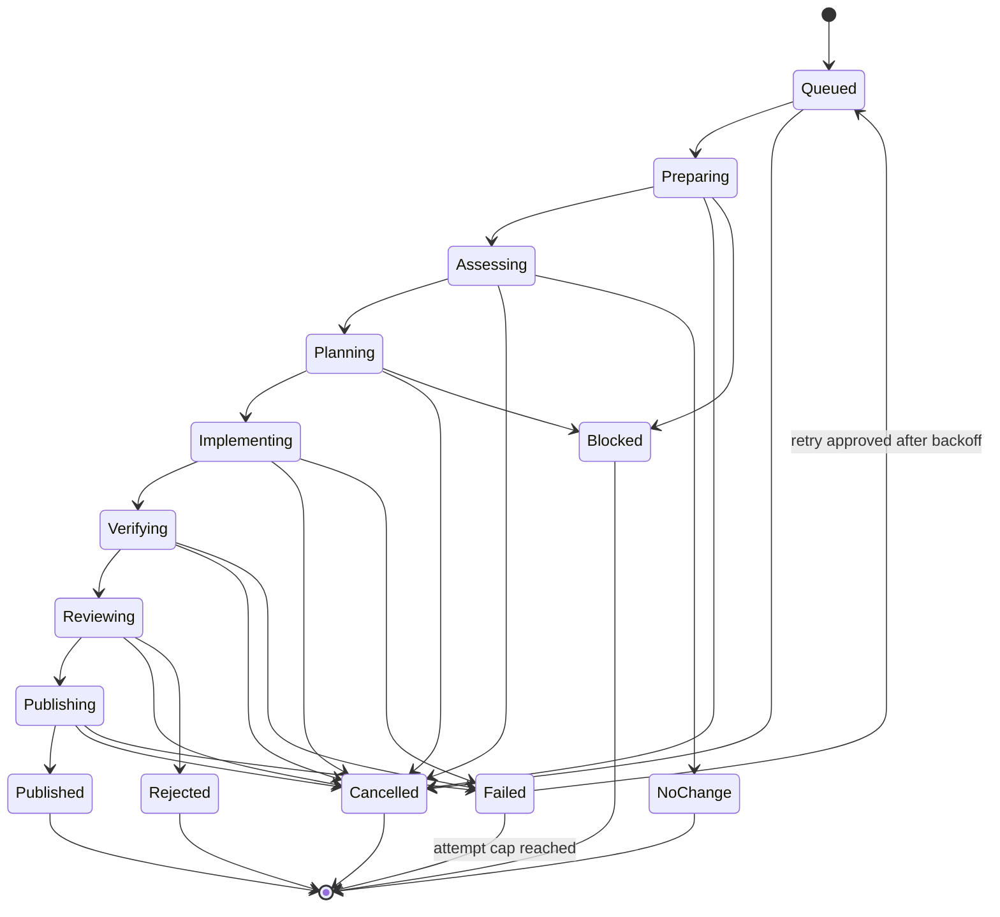
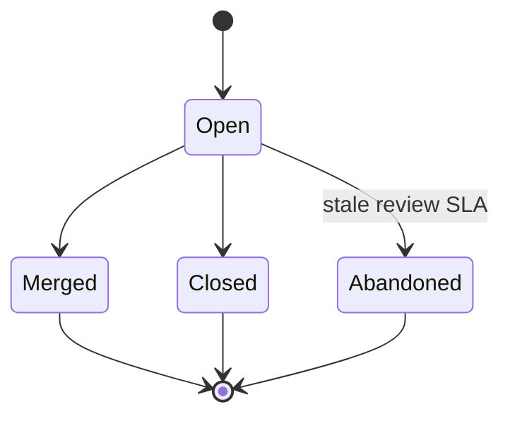

# Rook Orchestration Framework Plan

**Status:** Proposed  
**Date:** 2026-08-31  
**Initial scale:** 25-100 repositories with continuous daily maintenance  
**Initial autonomy:** Create draft pull requests; humans approve and merge  
**System of record:** Rook owns orchestration state and optionally references JARVIS application records

## 1. Executive recommendation

Build Rook as a .NET 10 modular monolith from one solution, deployed in four
role-isolated forms:

1. a control-plane web/API deployment that owns repository state, scheduling,
   policy, the operator experience, and audit evidence;
2. trusted integration/publisher workers with SCM and CI/CD provider access,
   including Raven-backed integrations, but no target-repository execution;
3. an ephemeral agent runner with a credential broker sidecar; and
4. a separate credential-free verifier Job for all repository-controlled
   command execution.

Use Microsoft Agent Framework workflows for explicit agent and function
composition, but keep correctness-critical control flow in deterministic C#.
Use the GitHub Copilot SDK as the first agent backend behind an interface so
local OpenShift-hosted models and Azure-hosted agents can be added later.
Install a pinned Crow release in each runner. Expose an allowlisted, read-only
subset of credential-bearing Raven MCP tools only from the trusted integration
worker; runners receive normalized source-control and pipeline observations as
immutable snapshots.

Model two independent provider assignments for every application:

- an **SCM provider** for source, branches, commits, and pull requests:
  on-premises Azure DevOps Server, GitHub, or Bitbucket; and
- zero or more **CI/CD pipeline providers**: Azure DevOps Pipelines, GitHub
  Actions, or Jenkins for the subset of applications that use it.

The pilot starts with on-premises Azure DevOps Server for SCM, pull requests,
and Azure DevOps Pipelines. GitHub and Bitbucket source adapters and GitHub
Actions/Jenkins pipeline adapters follow behind the same contracts.

Host the MVP in **OpenShift Gold with a shared PostgreSQL database on a VM**.
OpenShift provides the strongest fit for per-run isolation, bounded resources,
network policy, horizontal worker capacity, and repeatable deployment.
PostgreSQL is preferred for the new Rook-owned state store. The Windows
VM/shared MSSQL option is viable for a short feasibility prototype, but its
JARVIS-like deployment model does not provide the isolation and elastic job
execution needed for unattended maintenance across 25-100 repositories.

Do not make unattended scheduling generally available until a feasibility
spike proves that a developer-owned GitHub Copilot subscription can be used
securely, reliably, and within applicable licensing and usage limits from the
chosen runner environment. A run must bind to an explicit operator credential
profile. Expired, revoked, or exhausted credentials must fail closed and place
the run in `Blocked`, never silently switch identity or model.

## 2. Goals and non-goals

### 2.1 Goals

- Maintain applications that have already completed a developer-led Crow
  modernization and onboarding review.
- Detect and remediate framework currency, dependency currency, and feasible
  security issues.
- Create evidence-backed draft pull requests for human review.
- Support scheduled, event-triggered, and manually initiated runs.
- Keep durable per-repository state, findings, decisions, run history, and
  evidence.
- Support both manual priority decisions and explainable scored priority.
- Read each application's configured CI/CD provider state and normalize it into
  the application status record; Jenkins is optional, not assumed.
- Support source repositories in on-premises Azure DevOps Server, GitHub, and
  Bitbucket independently of the application's CI/CD provider.
- Make agent, model, Crow, Raven, workflow, and policy versions reproducible
  for every run.
- Add local and Azure agent backends without rewriting workflow policy.

### 2.2 Non-goals for the MVP

- Autonomous merge, deployment, production mutation, or CI/CD pipeline
  configuration/execution.
- Bringing an unmodernized application directly into unattended maintenance.
- Treating model output, an MCP response, or an agent's claim as verification.
- General-purpose infrastructure automation.
- Cross-repository code changes in one run.
- Long-term semantic memory or agents that modify their own skills or code.
- Making JARVIS the persistence store for Rook execution state.

## 3. Architecture principles

1. **Deterministic code owns the workflow.** Agents make bounded judgments;
   C# enforces sequence, policy, retries, budgets, acceptance criteria, and
   external-state verification.
2. **One agentic step, one judgment.** Separate discovery, planning,
   implementation, review, and explanation into typed steps.
3. **Evidence before state transition.** Builds, tests, scans, diff limits, and
   remote PR state are checked by code before a run can advance.
4. **The sandbox is the security boundary.** Prompt rules, tool allowlists,
   working directories, and MCP validation are defense in depth, not
   containment.
5. **Least capability per run.** Give each runner only the repository,
   credentials, Raven tools, network routes, and time it needs.
6. **Human control at consequential boundaries.** The MVP may open a draft PR
   but may not approve, merge, deploy, trigger or mutate CI/CD pipelines, or
   dismiss a security finding.
7. **Durable state is explicit.** Agent session history, workflow state,
   business state, and audit evidence have different lifetimes and storage
   rules.
8. **Every artifact is attributable.** Draft PRs, commits, comments, and reports
   identify Rook automation and the responsible run.
9. **Provider independence is deliberate, not universal.** Keep agent backend,
   SCM, and CI/CD provider contracts separate. Do not hide useful PostgreSQL,
   Azure DevOps Server, GitHub, Bitbucket, OpenShift, or Agent Framework
   behavior behind lowest-common-denominator abstractions.
10. **Unicode is end-to-end.** Repository names, owner names, findings,
    evidence, prompts, logs, reports, and database fields preserve Unicode and
    use UTF-8 interchange. Identifier security rules are separate from
    user-supplied display text.

These principles align with Crow's separation of agent decisions, routed skill
knowledge, stable templates, and deterministic scripts. They also incorporate
the strongest transferable ideas from NVIDIA's Object Oriented Agents project:
ordinary code remains the control plane, model-visible capabilities are narrow,
claims are verified outside the model, and the complete call tree is traced.

## 4. System context



### 4.1 Trust boundaries

- **Human boundary:** Operators authenticate through the approved corporate
  identity provider. Authorization is enforced by Rook, not by UI visibility.
- **Control-to-runner boundary:** A runner receives an immutable signed run
  envelope containing IDs, policy, versions, budgets, a nonce, an expiry, and
  signing-key ID. It cannot select a different repository or workflow. A
  narrow run-scoped identity lets it report only its own progress and upload
  bounded evidence; it cannot write business state directly.
- **Repository boundary:** Repository content, issues, build scripts, package
  metadata, and instructions files are untrusted input and may contain prompt
  injection or executable code.
- **MCP boundary:** Raven responses are untrusted data. Credential-bearing
  Raven servers run in the trusted integration boundary, not the repository
  sandbox. A runner may use only explicitly approved credential-free local MCP
  servers.
- **Provider boundary:** SCM and CI/CD are separate trust and authorization
  boundaries. A source repository may use a different CI/CD platform, and
  access to one never implies access to the other.
- **Model boundary:** Prompts and source may leave the Rook environment through
  the configured provider. Onboarding must record data classification and the
  provider policy approved for that repository.
- **Database boundary:** The control plane is the sole database writer and owns
  schema migrations. Runners have no database network path or credential.

## 5. Logical components

Start with one solution and enforce boundaries in projects. Do not create
separate network services for these modules until scaling or governance
requires it.

```text
src/
  Rook.Web/                 ASP.NET Core control-plane API and operator UI
  Rook.Application/         use cases, workflows, policies, scoring
  Rook.Domain/              state machines, entities, invariants
  Rook.Infrastructure/      EF Core, repository providers, MCP, telemetry
  Rook.AgentFramework/      Agent Framework and agent-backend adapters
  Rook.Worker/              trusted integration and publication worker
  Rook.Runner/              isolated per-run executable
  Rook.Verifier/            credential-free command executor
  Rook.Contracts/           versioned run envelopes and external contracts
tests/
  Rook.UnitTests/
  Rook.IntegrationTests/
  Rook.ArchitectureTests/
  Rook.EndToEndTests/
```

### 5.1 Control plane

Responsibilities:

- repository onboarding and policy management;
- manual run submission and operator cancellation;
- periodic scheduling and webhook/event intake;
- priority calculation and queue selection;
- durable run state, leases, idempotency, and recovery;
- OpenShift Job creation from an approved template;
- credential-profile selection by reference;
- operator UI/API, approvals, holds, and audit history;
- a fleet-wide pause/kill switch and review-capacity budgets;
- reconciliation of draft PRs and CI/CD pipeline state;
- trusted SCM publication and CI/CD observation workers;
- health, metrics, and administrative reporting.

The web and scheduler processes never clone target repositories or hold a
writable working tree. A separately permissioned publisher worker may create a
short-lived clean checkout solely to revalidate and publish an approved patch.
The integration worker may read provider metadata using a read-only application
credential.

### 5.2 Runner

Responsibilities:

- validate the signed run envelope and report readiness for the control plane's
  run lease;
- create a fresh, single-repository workspace;
- connect to run-scoped credential brokers without receiving their underlying
  secret values;
- install/use the exact pinned Crow and credential-free local MCP versions in
  the runner image;
- execute the selected Agent Framework workflow;
- enforce time, token, tool-call, process, CPU, memory, disk, and output limits;
- perform deterministic verification;
- submit an immutable patch, publication request, and evidence when all gates
  pass;
- submit each full typed step output through the run-scoped API; the control
  plane validates its contract version and envelope before persisting the
  payload and hash;
- flush telemetry and evidence, report terminal status, and exit.

Each attempt gets a new pod and workspace. No Copilot session, MCP client,
working tree, shell process, or mutable tool instance is shared between
concurrent runs.

The control plane, not the sandbox, publishes the draft PR. It revalidates the
target revision, publication key, patch hash, and verification evidence before
using a repository-scoped credential. The runner never receives a repository
write token or CI/CD provider credential.

### 5.3 Agent backend boundary

Define an application-owned interface such as `IAgentBackend` around the
capabilities Rook needs:

- create a run-scoped agent session;
- execute a typed agent step;
- stream structured progress events;
- report usage and model identity;
- cancel and dispose the session.

Initial implementation:

- `GitHubCopilotAgentBackend` using
  `Microsoft.Agents.AI.GitHub.Copilot`.

Future implementations:

- local OpenShift model/agent backend;
- Azure/Foundry agent backend.

Do not abstract MCP, tools, or provider-specific configuration prematurely.
Store the backend type and provider-specific, non-secret configuration as a
versioned policy document. Workflows consume Rook's typed step interface rather
than a provider SDK directly.

### 5.4 Crow integration

- Package Crow at a pinned release and checksum in the runner image.
- Resolve an approved workflow manifest to exact Crow agent, skill, module,
  template, and deterministic script versions.
- Use Crow agents for architecture/security assessment, remediation, and
  independent review.
- Keep Crow's deterministic scripts as mandatory gates where applicable.
- Record the Crow package version and content digest in every run and PR.
- Do not load skills, agents, hooks, or executable configuration from a target
  repository unless explicitly approved during onboarding.
- Treat a Crow upgrade as a controlled Rook dependency change with regression
  tests against representative repositories. Canary upgrades must also verify
  finding fingerprint aliases so an updated tool does not duplicate or orphan
  existing findings.

### 5.5 SCM and CI/CD integrations

SCM and CI/CD are independent per-application assignments. Do not infer the
pipeline provider from the source host or require both to use the same system.

Define an `ISourceControlProvider` contract for:

- repository and default-branch metadata;
- immutable commit lookup and archive/clone acquisition;
- branch and pull-request discovery;
- scoped branch publication and draft pull-request creation;
- pull-request status, comments, reviews, and reconciliation.

Implement providers in this order:

1. **On-premises Azure DevOps Server** for the pilot;
2. **GitHub**;
3. **Bitbucket**.

Define a separate `IPipelineProvider` contract for read-only observation:

- pipeline/job identity and configured source reference;
- latest and recent runs, state, result, timestamp, duration, and URL;
- source branch and commit correlation where available;
- test summaries, artifacts metadata, and change information;
- narrowly targeted, redacted failed-run log retrieval;
- provider observation time, freshness, and collection error.

Implement pipeline providers in this order:

1. **Azure DevOps Pipelines** for the pilot;
2. **GitHub Actions**;
3. **Jenkins** for the subset of applications that use it.

An application can have zero, one, or multiple configured pipeline bindings.
For example, source can be in Bitbucket while a Jenkins job builds it, or source
can be in GitHub while Azure DevOps Pipelines performs deployment. Each binding
records its role, such as validation, build, security scan, or deployment. The
MVP observes existing runs and never triggers, stops, promotes, or reconfigures
a pipeline.

Use Raven as an MCP integration layer, not as Rook's workflow engine.
Credential-bearing Raven servers execute in a trusted integration worker that
has no target working tree and never executes repository code. Configure a
provider-specific read-only tool allowlist:

- Raven ADO tools for Azure DevOps repository, pull-request, and pipeline state;
- Raven/GitHub tools or GitHub APIs for repository, pull-request, and Actions
  state;
- Raven Bitbucket tools for repository and pull-request state;
- Raven Jenkins tools only for configured Jenkins pipeline bindings.

The pilot must verify Raven's current ADO coverage against the
`IPipelineProvider` contract. If it exposes pipeline definitions but not build/
run state, test summaries, changes, and logs, extend the Raven ADO MCP before
calling the ADO pipeline integration complete. Rook must not scrape the ADO web
UI or fill missing fields with success-shaped defaults.

Runner-local MCP servers are limited to credential-free analysis such as code
indexing; they must not hold SCM, CI/CD, Rook database, or control-plane
credentials.

Normalize every provider into a common `PipelineStatusSnapshot` while retaining
provider-specific extension data:

- provider type, server/organization/project, and canonical pipeline identity;
- binding role and required/optional status;
- source branch and revision when available;
- latest run identity, URL, state/result, timestamp, and duration;
- last successful and last failed run;
- test totals and failures when exposed;
- queue/running state where exposed;
- observation time, freshness, collection error, and adapter/tool version.

Do not persist full pipeline logs by default. They can contain credentials and
personal information. For diagnosis, retain a redacted excerpt as short-lived
evidence and keep the source URL. An unavailable, unconfigured, or
inaccessible provider produces an explicit `NotConfigured`, `Unavailable`,
`Unknown`, or `Stale` status as appropriate; it must not be reported as healthy
or treated as proof that the application has no CI/CD.

### 5.6 JARVIS integration

Rook owns automation policy and execution state. A repository may optionally
store a JARVIS application ID. Rook may read business criticality, owner, and
technology metadata through a read-only JARVIS integration, but it snapshots
the values used for a priority decision so later JARVIS changes do not rewrite
history.

Rook must continue operating when JARVIS is unavailable. A missing required
criticality or ownership value blocks onboarding or prioritization according to
policy rather than silently assigning a benign default.

## 6. Workflow design

### 6.1 Run and change-proposal state machines

A run is bounded by one automation attempt series and ends when a proposal is
published. Human review is a separate, potentially long-lived lifecycle owned
by `ChangeProposal`.





Every transition is:

- validated against the current state;
- written with optimistic concurrency;
- accompanied by a timestamp, actor, reason, and evidence references;
- safe to retry using the applicable identity key;
- emitted through an outbox event in the same transaction.

Use two identities:

- **Run deduplication key:** repository + target commit + ordered set-hash of
  finding fingerprints + workflow version + policy version. A partial unique
  constraint applies only to non-terminal runs, so duplicate triggers join the
  active attempt series while an authorized manual re-trigger can create a new
  series after a terminal outcome.
- **Publication key:** repository + ordered set-hash of finding fingerprints +
  workflow version. A unique constraint allows at most one open proposal for
  the same problem, even when the default branch advances. A second uniqueness
  rule permits each finding to belong to at most one open proposal, preventing
  overlapping sets such as `{A}` and `{A,B}`.

Resume means deterministic replay from durable, typed outputs of completed
steps. Implementation and verification restart in a fresh runner after
infrastructure failure. The MVP does not restore opaque shell processes,
worktrees, model context, or agent sessions. Agent Framework checkpoint storage
is ephemeral to an attempt unless a later security review approves encrypted,
redacted cross-pod checkpoint persistence.

`Rejected` means the independent review rejected publication. The finding stays
open and backoff applies. Attempt accounting distinguishes:

- **Cap-consuming functional attempts:** model/implementation failure,
  deterministic verification failure, and independent-review rejection.
- **Bounded infrastructure retries:** runner/verifier provisioning failure,
  transient network/provider failure, and other platform errors. These use a
  separate retry budget and do not consume the finding's functional cap.
- **Non-attempt outcomes:** operator cancellation, policy hold/block, or
  `PauseAll`. They do not retry until their explicit release condition occurs.
- **Publication retries:** retry from the stored immutable patch without
  re-running the agent and use a separate bounded publication retry budget.

`Blocked` requires a defined release condition and owner. An abandoned proposal
is reconciled, its branch is cleaned up according to policy, and its findings
remain open.

### 6.2 Standard maintenance workflow

1. **Preflight (deterministic)**
   - Confirm repository eligibility, maintenance window, no active hold, and no
     open Rook PR with the same publication key or a policy-defined overlapping
     path set.
   - Resolve exact target commit and acquire a repository lease.
   - Resolve credential, Crow, Raven, model, workflow, and policy versions.
   - Confirm credential health and remaining usage budget.
   - Enforce `maxAttemptsPerFinding` (default 3), exponential backoff, repository
     and owner PR caps, and the fleet-wide daily publication budget. Route an
     exhausted finding to `NeedsHuman`.
2. **Observe (deterministic with read-only integrations)**
   - Refresh SCM, framework, dependency, security, and all configured CI/CD
     pipeline observations in trusted integration workers.
   - Deduplicate findings by stable fingerprint.
3. **Triage (agent judgment with typed output)**
   - Classify applicability, likely impact, and candidate action.
   - Code validates all cited files, versions, alerts, and external references.
4. **Plan (agent judgment with typed output)**
   - Produce bounded changes, expected files, migration risk, verification
     commands, and rollback notes.
   - Policy rejects plans outside the workflow's authority.
5. **Implement (Copilot/Crow in sandbox)**
   - Modify only the isolated workspace.
   - Keep Copilot's first-party shell/file/URL tools disabled. Rook-controlled
     workspace and MCP tools are deny-by-default and authorized against the run
     envelope.
   - Run all repository-defined, package-manager, restore, build, test, scan,
     and generated commands only in the credential-free verifier Job. Any local
     runner command tool is limited to fixed Rook-authored operations that do
     not load or execute repository content.
6. **Verify (deterministic)**
   - Confirm diff scope and size, no forbidden files, no generated secrets, and
     no unrelated changes.
   - Run repository-declared restore/build/test/lint/security commands with
     explicit timeouts.
   - Require non-vacuous results: expected test discovery, scan inputs, and
     artifacts must exist.
7. **Independent review (separate agent session)**
   - Review the diff, evidence, risk, and original finding without inheriting
     the implementation session's mutable state.
   - Deterministic code validates review references.
   - Treat the review as advisory evidence. It never substitutes for
     deterministic verification and may use a different approved model when
     this measurably reduces correlated failure.
8. **Publish**
   - Submit the patch and publication request to the trusted publisher.
   - Revalidate target revision, publication uniqueness, diff policy, and
     evidence before pushing a Rook branch and creating the draft PR.
   - Create a draft PR clearly labelled as automated.
   - Include finding, changes, evidence, residual risks, rollback, run ID,
     versions, and links to retained evidence.
   - Once the first remote write starts, record cancellation as pending, finish
     creating/reconciling the proposal, then close it if cancellation still
     applies. Retry a transient publication failure from the stored patch.
9. **Reconcile**
   - Poll or receive provider events for PR updates.
   - Record human review, merge/close outcome, and subsequent configured CI/CD
     pipeline results.
   - Reopen or create a follow-up finding when post-merge validation fails.
   - Sweep for Rook-authored branches or PRs without matching state and either
     adopt or clean them up through an audited operator-visible action.

### 6.3 Initial workflow catalogue

| Workflow | Trigger | Scope | Minimum evidence |
| --- | --- | --- | --- |
| Framework currency | cadence, EOL horizon, manual | supported patch/minor first; major by policy | framework inventory, release/EOL source, build and tests |
| Dependency currency | cadence, security alert, manual | one coherent package group | lockfile diff, vulnerability audit, build and tests |
| Security remediation | confirmed finding, manual | supported Crow finding types | source evidence, data-flow evidence, security tests, independent review |
| CI/CD status refresh | cadence, manual | all configured pipeline bindings | normalized snapshots with source timestamps and explicit unconfigured/unavailable states |
| Repository health refresh | cadence, provider event | metadata only | target revision, branch protection, CI and open Rook PR state |

Run discovery separately from remediation. A discovery failure must not erase or
close an existing finding. A finding is closed only by deterministic evidence
or an explicit human decision.

## 7. Per-repository state

### 7.1 Core records

**Repository**

- optional JARVIS application ID;
- owners, business criticality, data classification, and support tier;
- enabled workflows, cadence, maintenance window, concurrency limit;
- allowed agent backends/models and data-boundary policy;
- credential-profile references, never credential values;
- build/test/scan commands and expected-result contracts;
- branch/PR policy, maximum diff, forbidden paths, required reviewers, reviewer
  notification route, per-repository open-PR cap, and weekly new-PR cap;
- onboarding status, last successful snapshot, and next eligible run.

**SourceRepositoryBinding**

- SCM provider (`AzureDevOpsServer`, `GitHub`, or `Bitbucket`);
- server/base URL, collection/organization/workspace, project, immutable
  provider repository ID, display name, URL, and default branch;
- read credential profile, publication credential profile, provider capability
  flags, webhook configuration, and last successful reconciliation;
- exactly one active source binding per Rook repository in the MVP.

**PipelineBinding**

- pipeline provider (`AzureDevOpsPipelines`, `GitHubActions`, or `Jenkins`);
- server/organization/project and immutable pipeline/job/workflow identity;
- role (`Validation`, `Build`, `SecurityScan`, or `Deployment`), branch/ref
  mapping, required/optional status, and freshness threshold;
- read credential profile, provider-specific configuration, and last successful
  observation;
- zero or more bindings per repository, independent of the source binding.

**WorkflowManifest**

- immutable version and content digest;
- workflow graph and typed contract versions;
- Crow, local MCP, backend, model, runner image, and deterministic-tool pins;
- tool/command/URL/network allowlists and default budgets.

**CredentialProfile**

- ID, credential type, secret-manager or broker reference, owner, approved
  repositories/workflows, expiry, rotation status, and entitlement/quota class;
- no secret value, OAuth refresh token, or API token.

**ReviewTeam and FleetPolicy**

- owner/team identity, repository assignments, notification route, reviewers,
  open-PR cap, weekly review capacity, and escalation path;
- versioned fleet daily publication budget, global concurrency, `PauseAll`,
  default attempt/retry budgets, and change-approval history.

**ObservationSnapshot**

- immutable SCM, dependency, framework, security, and normalized CI/CD provider
  facts;
- source revision, collection time, source/tool version, freshness, and errors.

**Finding**

- stable fingerprint based on provider-independent rule ID, repository-relative
  location/subject, and normalized evidence identity; tool version is excluded;
- fingerprint aliases/migrations, type, source, title, description, evidence;
- severity, confidence, affected versions/paths, first/last observed;
- status, owner, suppression/acceptance reason and expiry;
- risk score inputs/version, automation-eligibility inputs/version, and latest
  decisions;
- links to attempts, PRs, alerts, and replacement findings.

**Run and RunStep**

- trigger, requested actor, credential profile, repository/target commit;
- workflow/policy/Crow/Raven/backend/model/image versions;
- state transitions, leases, retries, budgets, usage, timing, and errors;
- full versioned typed inputs/outputs persisted through the control-plane
  reporting API, payload hashes, and evidence references for each step.

**Attempt**

- run/attempt-series identity, runner and verifier Job identities, start/end;
- functional, infrastructure, publication, cancellation, or policy outcome;
- normalized failure taxonomy, retry/backoff decision, and whether the outcome
  contributes to the finding's functional attempt cap.

**ChangeProposal**

- publication key, ordered finding set, branch, commits, diff hash,
  verification results, review result;
- draft PR identity/state, human reviews, merge/close result;
- post-merge SCM and configured CI/CD pipeline observations.

**AuditEvent**

- append-only actor, action, target, time, correlation ID, decision, and
  before/after hashes; sensitive payloads are excluded.

### 7.2 State lifetimes

- **Ephemeral:** model context, shell processes, worktree, MCP clients, and
  unredacted command output, including Agent Framework attempt checkpoints.
  Destroy with the runner.
- **Durable operational:** run state, typed step summaries, immutable
  observations, full typed step outputs or evidence-store references, evidence
  hashes, PR references, scores, and audit events.
- **Retained evidence:** redacted logs, test/scan reports, diffs, and traces
  under a documented retention schedule.
- **Long-term memory:** not in the MVP. Add only for a defined use case with
  provenance, deletion, privacy, poisoning controls, and human correction.

## 8. Prioritization

### 8.1 Risk score and automation eligibility

Calculate and persist an explainable 0-100 `RiskScore` from a versioned formula:

| Factor | Weight | Examples |
| --- | ---: | --- |
| Security severity and exploitability | 45 | confirmed severity, reachability, known exploitation, exposure |
| Framework/platform support horizon | 25 | unsupported runtime, approaching EOL, missed security patch |
| Business criticality | 20 | JARVIS/Rook criticality, public service impact |
| Finding age and SLA status | 10 | first observed, SLA breach, accepted-risk expiry |

Rules:

- P0: 90-100, P1: 75-89, P2: 50-74, P3: 25-49, P4: 0-24.
- A confirmed critical remotely exploitable issue has a P0 floor.
- An internet-facing unsupported framework has at least a P1 floor.
- Risk does not include fix confidence, test health, credential availability, or
  previous automation failures.
- Missing or stale inputs reduce score confidence and may block automation;
  they do not become zero-valued benign inputs.
- Persist each factor, source snapshot, formula version, risk score, confidence,
  and calculation time.

Calculate a separate versioned `AutomationEligibility` decision (`Eligible`,
`NeedsHuman`, or `Blocked`) and confidence from:

- supported workflow and bounded change;
- clean or understood baseline from every required configured CI/CD binding;
- reliable build/test/scan contracts;
- prior attempt outcomes and current backoff;
- credential, quota, maintenance-window, and sandbox availability;
- target revision and conflicting-proposal state.

Low fix confidence or repeated failure never lowers visible risk. It changes
automation eligibility. After the configured attempt cap, set `NeedsHuman` and
stop automatic retries until a human changes the finding or workflow state.

### 8.2 Manual priority

Support three modes:

- `Automatic`: priority comes from the current score.
- `ManualOverride`: an operator sets P0-P4 and optional rank.
- `Hold`: excluded from execution until a date/event or explicit release.

An override or hold requires reason, actor, timestamp, owner, and review/expiry
date. Rook keeps displaying the risk score beside the effective manual
priority so risk is not concealed. Expired overrides return to automatic mode
after notifying the owner.

Queue order is:

1. safety or regulatory hard floors;
2. effective priority bucket;
3. manual rank within the bucket;
4. risk score;
5. SLA age;
6. oldest eligible run time.

Only `Eligible` work enters the automatic queue. Repository concurrency,
maintenance windows, credential/model quotas, attempt backoff, existing or
overlapping Rook PRs, `maxOpenRookPrsPerRepo`,
`maxNewRookPrsPerRepoPerWeek`, per-owner review capacity, and the fleet-wide
daily PR budget are eligibility gates, not risk factors. An administrator can
activate `PauseAll`, which prevents new runner and publication work while
leaving status collection and the operator UI available.

## 9. Persistence and reliability

Use PostgreSQL with EF Core migrations and provider-specific integration tests.
Recommended patterns:

- optimistic concurrency tokens on mutable records;
- database leases with heartbeat and expiry for repository/run ownership;
- `FOR UPDATE SKIP LOCKED` or an equivalent safe claim pattern for work
  selection;
- transactional outbox for job creation, notifications, and reconciliation;
- partial unique active-run deduplication constraints, one-open-proposal
  publication-key constraints, and one-open-proposal-per-finding membership;
- immutable observation/evidence records with hashes;
- partition or archive high-volume step and telemetry metadata;
- automated backups, point-in-time recovery, restore tests, and defined RPO/RTO.

Keep Rook's business state machine authoritative even if Agent Framework
checkpointing or the Durable Extension is used. Framework checkpoint data is an
execution aid, not the only record of why an action occurred.

Microsoft's Durable Extension supports self-hosted durable workflows, but its
current C# package path and Durable Task Scheduler dependencies must be proven
from OpenShift, including networking, data residency, preview-package policy,
operational ownership, checkpoint encryption/redaction, and recovery behavior.
The MVP persists only Rook's typed step outputs and database-backed state
machine across pods. Adopt cross-pod Agent Framework checkpoints or the Durable
Extension only if the spike demonstrates a clear reliability benefit without
introducing an unapproved Azure control-plane dependency or retaining
unredacted model/tool context.

## 10. Security and safety controls

### 10.1 Identity and authorization

- Corporate OIDC for operators.
- Roles: `Viewer`, `Operator`, `Maintainer`, and `Administrator`.
- Resource-level authorization for repository, credential profile, workflow,
  manual priority, evidence, and cancellation operations.
- Separate credentials for:
  1. Copilot/model access;
  2. SCM read and repository clone/archive acquisition;
  3. SCM branch/pull-request publication;
  4. read-only CI/CD provider observation through Raven or direct adapters;
  5. Rook database access.
- Prefer short-lived provider tokens for repository operations where supported.
  Never reuse the Copilot identity as the repository write credential merely
  for convenience.
- Implement the MVP publisher for on-premises Azure DevOps Server first.
  Because its PAT model may not provide GitHub App-style short-lived,
  per-repository credentials, require least available scope, separate read and
  publication identities, secret-manager storage, rotation, expiry monitoring,
  revocation drills, and repository/project authorization as compensating
  controls. Apply equivalent provider-specific controls when GitHub and
  Bitbucket are added.
- Store secret references in Rook and values in the platform secret manager.
  Never place secrets in prompts, run envelopes, logs, evidence, or database
  JSON.

### 10.2 Copilot permission policy

Microsoft Agent Framework's Copilot integration delegates tool approval to the
Copilot SDK's native pre-tool hook. Rook must own one reviewed hook that:

- defaults to deny;
- allows only the run's command/path/URL/MCP policy;
- handles every `ApprovalRequiredAIFunction`;
- cannot be replaced by target repository configuration;
- records each decision without sensitive arguments;
- treats an unknown tool or approval type as a hard failure.

The feasibility spike must test the warning that a custom `OnPreToolUse` hook
replaces the integration's default approval hook. Automated tests must prove
that destructive and out-of-scope tools remain denied.

### 10.3 Runner containment

- One non-root pod per attempt using the approved immutable image.
- Read-only root filesystem; writable ephemeral workspace only.
- No host mounts, container socket, default service-account token, or broad
  namespace permissions in the runner. Use only an audience-restricted,
  short-lived projected identity that can call the runner API for its run.
- Keep Copilot credentials in a per-run broker/sidecar with no workspace mount.
  Disable Copilot's first-party shell/file/URL tools and expose Rook-controlled
  workspace and verifier-dispatch tools. The broker authenticates the caller
  against the run's projected identity and enforces the envelope's model,
  expiry, and call/usage budget. The feasibility spike must prove this external
  server/broker shape before it becomes the production design.
- Execute repository-controlled restore/build/test/scan commands in a separate
  credential-free verifier Job. It receives an immutable workspace artifact,
  has no route to the control plane or credential broker, and writes result
  metadata plus capped artifacts to a per-attempt output volume. After the Job
  exits, a trusted collector mounts that volume, computes hashes, validates the
  expected-result contract, and persists the evidence. The verifier holds no
  signing key or reporting credential.
- Seccomp, dropped Linux capabilities, restricted security context, CPU/memory/
  process/disk/time limits, and pod deadline.
- Egress allowlist by workflow: repository host, approved package registries,
  run-scoped control-plane endpoint, Copilot broker, credential-free local MCP
  endpoints, and telemetry collector. The verifier uses a stricter registry-
  only policy.
- The runner has no repository write, CI/CD provider, Raven integration,
  database, or control-plane administrative credential.
- Explicit child-process cancellation and cleanup.
- Destroy workspace and pod after evidence extraction.

The control plane may create Jobs only from a fixed server-side template and
validated parameters. Its service account is namespace-scoped and cannot
create arbitrary privileged workloads. Runner and verifier Jobs set
`restartPolicy: Never`, `backoffLimit: 0`, and `activeDeadlineSeconds`; Rook,
not the Kubernetes Job controller, creates a new attempt after backoff. Signed
envelopes include a single-use nonce, not-before/not-after times, audience,
signing-key ID, and key-rotation policy, and the control plane rejects replay.

### 10.4 Prompt injection and untrusted content

- Keep system/workflow policy immutable and separate from repository data.
- Pass source, issues, MCP output, and logs through data parameters, not by
  interpolation into trusted instructions.
- Ignore repository instructions that request broader credentials, different
  tools, disabled verification, or policy changes.
- Validate every agent citation against the actual target commit or external
  source.
- Sanitize model-authored PR text and links.
- Never execute newly created agent/skill definitions from the target repo in
  the same run.

### 10.5 Supply chain

- Pin the .NET SDK, NuGet lock files, Crow/Raven releases, container base image,
  security scanners, and deterministic scripts.
- Verify checksums/signatures and generate an SBOM for runner and control-plane
  images.
- Scan images and dependencies before promotion.
- Fail when a checker did not actually inspect expected inputs.
- Record image digest and package/tool versions in each run.

### 10.6 Data and telemetry

- Use structured logs, correlation/run IDs, metrics, and OpenTelemetry traces
  across control plane, workflow, agent step, model call, tool call, command,
  and provider operation.
- Redact before export. Do not retain hidden model reasoning.
- Store typed summaries and required evidence, not unlimited transcripts.
- Define retention by evidence class and support legal hold/deletion policy.
- Test UTF-8/Unicode round trips through UI, API, PostgreSQL, queue state, MCP
  data, PR content, logs, and exports, including combining marks and Indigenous
  language characters.

## 11. Hosting options

### 11.1 Evaluation criteria

Scores use 1 (poor) to 5 (strong). Weighting reflects unattended execution of
untrusted repository code across 25-100 repositories.

| Criterion | Weight | OpenShift Gold + PostgreSQL VM | Windows VM + shared MSSQL |
| --- | ---: | ---: | ---: |
| Per-run isolation and least privilege | 25% | 5 | 2 |
| Scale and concurrency | 15% | 5 | 2 |
| Operational resilience and self-healing | 15% | 4 | 2 |
| Deployment consistency and rollback | 10% | 5 | 3 |
| Network and secret policy | 10% | 5 | 3 |
| Fit for mixed application toolchains | 10% | 5 | 3 |
| Initial implementation simplicity | 10% | 3 | 5 |
| Alignment with JARVIS/Windows operations | 5% | 2 | 5 |
| **Weighted score** | **100%** | **4.50** | **2.75** |

This comparison scores the two requested hosting choices. Cost, procurement/
onboarding lead time, Gold disaster-recovery obligations, and team operating
capacity require platform-owner estimates and are explicit decision gates
rather than invented scores. Alternatives not selected for this comparison
include in-cluster PostgreSQL (outside the requested shared-database topology),
OpenShift Silver (availability/DR requirements not yet established), and using
CI agents as the runner substrate (useful later, but it would couple Rook's
security and scheduling model to heterogeneous repository CI).

### 11.2 Option A: OpenShift Gold with shared PostgreSQL on a VM

**Strengths**

- A fresh pod is a natural OS-level isolation boundary for each run.
- Resource quotas, deadlines, security contexts, network policies, and
  namespace-scoped identities are platform capabilities.
- Runner concurrency can grow independently of the control plane.
- Immutable images and deployment manifests improve reproducibility and
  rollback.
- Linux containers fit the widest range of modern repository build tooling.
- PostgreSQL provides a strong new-application state store and effective
  database queue/lease primitives.

**Risks and mitigations**

- A database VM remains an external operational dependency: require TLS,
  restricted network access, backups, PITR, restore tests, monitoring, and
  separately managed credentials.
- Creating Jobs requires Kubernetes API authority: use a namespace-scoped
  control-plane service account and a fixed validated Job template.
- Copilot user authentication in ephemeral containers is unproven: complete the
  authentication/licensing spike before selecting the production credential
  flow.
- Package restore egress can be broad: maintain approved registries/proxies and
  workflow-specific network policy.
- OpenShift operations require platform skills: provide runbooks, dashboards,
  quotas, and tested failure recovery before onboarding critical repositories.

**Database choice**

Use PostgreSQL for Rook. MSSQL remains technically possible, but supporting
both providers in the MVP would double migration, locking, query, and test
paths without user value. Exchange data with JARVIS through its API/MCP
contract, not cross-database joins.

### 11.3 Option B: Windows VM with shared MSSQL, similar to JARVIS

The ADO JARVIS review found a .NET 10 ASP.NET Core API, separate Blazor
WebAssembly UI, EF Core SQL Server persistence, Keycloak authentication,
Serilog EventLog/file output, Azure DevOps build/test/Sonar/SBOM steps, and
self-contained Windows/IIS-oriented artifacts. Its documentation identifies
Windows Server 2025 and SQL Server 2019 as the intended deployment shape.
However, the repository does not define production deployment automation,
backups, failover, alert routing, or RTO/RPO. JARVIS is an inventory web
application, not an untrusted-code execution platform.

**Strengths**

- Familiar .NET, IIS/Windows Service, MSSQL, DPAPI, and operational tooling.
- Fastest path for a single-user Copilot/Raven feasibility prototype.
- Similar build and deployment skills to JARVIS.
- Straightforward access to Windows-only repositories and build tools.

**Risks**

- Process/workspace ACLs and a configured working directory are not sufficient
  containment for model-directed shell execution.
- Strong isolation would require Windows containers, Hyper-V isolation, or
  separate VMs, which removes much of the simplicity advantage.
- One VM is a shared failure and resource-contention domain.
- Parallel mixed-toolchain runs require careful process, port, filesystem,
  credential, and cleanup management.
- Scaling and patching are more manual.
- Long-lived developer Copilot and Raven credentials are more likely to become
  machine-wide ambient authority.

**Appropriate use**

Use this option for the phase 0 prototype only if OpenShift access would delay
the authentication and Agent Framework spikes. Do not treat a successful
in-process Windows prototype as evidence that the production containment model
is adequate.

### 11.4 Decision

**Preferred: OpenShift Gold with PostgreSQL on a VM.**

The deciding factor is the workload, not the language. Rook intentionally
executes repository-controlled build and test code under model direction.
OpenShift provides the clearest enforceable security boundary and operational
path for 25-100 continuously maintained repositories. The recommendation is
conditional on validating Copilot authentication from ephemeral runners and
operational acceptance of the PostgreSQL VM.

The MVP onboarding gate requires Linux-compatible build and verification.
Windows-only/.NET Framework repositories are deferred to a separately isolated
Windows runner pool in a later phase; they must not be marked maintainable when
Rook cannot execute their required verification.

### 11.5 Capacity and entitlement model

Size the platform from measured pilot values, not repository count alone:

```text
agent runs/day =
  eligible repositories x average maintenance findings per repository/day

required average concurrency =
  (agent runs/day x p75 run duration) / scheduling window

requested quota =
  (peak runner concurrency x runner resources) +
  (peak verifier concurrency x verifier resources)

Copilot demand =
  agent runs/day x p75 prompts/model calls per run, including retries

sustainable open PRs =
  reviewers x PRs reviewed per reviewer/week x average review lifetime in weeks
```

The initial quota worksheet must model status-only runs separately because
SCM and CI/CD status refreshes do not require Copilot. Phase 0 measures wall
time, model calls, premium requests/tokens where available, verifier resources,
artifact volume, and retry rate on representative repositories. Phase 1
requests quota for the ADO pilot plus a defined burst/retry margin and accounts
for whether the runner remains resident while verifier Jobs execute.
Repository, owner, and fleet publication budgets derive from measured reviewer
throughput and target review lifetime. An individual developer entitlement is
not assumed sufficient for Phase 3 or 4; those phases require an approved
organizational/enterprise entitlement and named budget owner based on measured
daily demand.

## 12. Observability and operations

### 12.1 Required signals

- Queue depth and age by priority/workflow.
- Eligible, blocked, held, running, failed, and no-change runs, plus open,
  merged, closed, and abandoned change proposals.
- Run duration and step duration.
- Agent/model/tool calls, retries, denials, usage, and budget exhaustion.
- Runner creation latency, pod failures, timeouts, and cleanup failures.
- Build/test/scan result and non-vacuous verification failures.
- Draft PR creation rate, human acceptance rate, time to review, merge rate,
  rework rate, and post-merge failure rate.
- Review-agent rejection/disagreement rate and agreement with human review.
- Open Rook PRs and new PRs by repository, owner, and fleet budget; reviewer
  notification delivery and backlog age.
- Finding age, recurrence, suppression expiry, and score-confidence gaps.
- CI/CD snapshot freshness, collection failures, and coverage by provider and
  required binding.
- Credential expiry/revocation without exposing credential material.

### 12.2 Health behavior

- Liveness checks only process health.
- Readiness checks database connectivity, migration compatibility, and required
  platform integrations without causing cascading failures.
- An unavailable agent backend, SCM provider, CI/CD provider, or Raven server
  degrades only the affected repositories/workflows and creates explicit
  blocked/unavailable/stale states; it does not make the whole UI unavailable.
- Bounded queues and per-repository/global concurrency limits provide
  backpressure.
- `PauseAll` stops new automation and publication immediately without hiding
  current state; repository/owner/fleet PR budgets stop reviewer overload.
- Operator cancellation propagates to workflow, SDK, MCP calls, child
  processes, and OpenShift Job deletion.

### 12.3 Service objectives proposed for pilot

- No more than one open draft PR for a repository, ordered finding set, and
  workflow publication key.
- No finding belongs to more than one open draft PR.
- 100% of published PRs link to deterministic verification evidence.
- 100% of consequential tool requests have an audit decision.
- Stale run lease detected and recovered or blocked within 15 minutes.
- Required CI/CD binding status freshness under 24 hours for enabled
  repositories; repositories without a configured binding explicitly report
  `NotConfigured`.
- 99% of terminal runs have complete flushed traces and state transitions.

Set availability, RPO/RTO, retention, and response-time targets with platform
owners before production. The values above are pilot acceptance targets, not a
production SLA.

## 13. Delivery roadmap

### Phase 0 - Feasibility and threat-model spikes

Build disposable prototypes; do not onboard production repositories.

1. **Copilot authentication and licensing**
   - Authenticate the .NET SDK in Windows and an ephemeral OpenShift pod.
   - Test signed-in user, approved token environment flow, revocation,
     expiration, rate/usage exhaustion, and concurrent sessions.
   - Confirm licensing, unattended use, data handling, and operator
     accountability with GitHub/organizational policy owners.
   - Measure model calls/usage, wall time, retries, and resource cost per
     representative run; identify the entitlement needed at 25 and 100 repos.
2. **Permission enforcement**
   - Prove deny-by-default shell/file/URL/MCP behavior.
   - Test the custom pre-tool hook replacement warning and unknown-tool denial.
   - Prove the Copilot credential broker has no workspace and the credential-
     free verifier has no route to Rook or model/repository credentials.
   - Prove repository-controlled code cannot reach, impersonate a runner to, or
     exhaust the Copilot broker.
3. **Crow and Raven**
   - Run one Crow assessment in an isolated runner.
   - Read an ADO-hosted pilot repository and its Azure DevOps Pipeline state
     through the trusted integration worker.
   - Identify and implement any missing Raven ADO operations required for
     build/run details, test summaries, changes, and bounded log retrieval.
   - Confirm package pinning, MCP authentication, redaction, and cancellation.
4. **Agent Framework**
   - Implement a typed assess-plan-verify workflow with deterministic replay
     from durable typed step outputs.
   - Compare standard checkpointing with the Durable Extension from OpenShift.
5. **Sandbox**
   - Execute adversarial repository instructions and build scripts against
     filesystem, network, process, secret, and resource boundaries.

**Exit gate:** a documented go/no-go decision for Copilot-backed unattended
runs, with an approved credential/broker and containment design, measured
per-run cost, and entitlement class for pilot and scaled operation.

### Phase 1 - Control plane and manual pilot

- Create the .NET solution and module boundaries.
- Implement OIDC/RBAC, repository onboarding, policy, audit, and PostgreSQL
  migrations.
- Implement durable run state, outbox, leases, cancellation, and reconciliation.
- Build the fixed OpenShift runner Job template and signed run envelope.
- Implement on-premises Azure DevOps Server first for repository access, branch
  publication, draft pull requests, and Azure DevOps Pipeline observations.
- Complete the Raven ADO MCP additions identified in phase 0 and contract-test
  them against an approved non-production ADO project.
- Add manual ADO pipeline-status refresh and one manual assessment workflow.
- Add operator UI for repository state, runs, evidence, holds, and overrides.
- Inventory portfolio toolchains and keep Windows-only repositories out of the
  Linux-runner eligibility set.

**Exit gate:** operators can run a read-only assessment against an ADO-hosted
pilot repository, see normalized Azure DevOps Pipeline state and reproducible
evidence, and create no repository mutation.

### Phase 2 - Draft PR maintenance

- Add dependency and framework update workflows.
- Add isolated implementation, deterministic verification, independent review,
  branch push, and draft PR creation.
- Add Rook bot labelling and PR templates.
- Add ADO webhooks and PR reconciliation.
- Add repository profile auto-discovery for build/test/scan candidates,
  followed by mandatory operator confirmation and an onboarding-effort metric.
- Pilot with 3-5 low-risk ADO-hosted repositories representing different
  stacks and Azure DevOps Pipeline shapes.

**Exit gate:** at least 20 pilot proposals with no policy escape, duplicate PR,
secret exposure, or unexplained verification result, plus an agreed minimum
human acceptance rate and measured onboarding hours per repository.

### Phase 3 - Scored scheduling and security remediation

- Implement versioned scoring, manual overrides/holds, fairness, windows, and
  quotas.
- Schedule daily status refresh and eligible maintenance.
- Add GitHub and Bitbucket SCM/PR adapters.
- Add GitHub Actions and optional Jenkins pipeline observers.
- Add approved Crow security remediation classes and provider-appropriate
  security observations.
- Expand to 25 repositories with dashboards, alerts, backup/restore tests, and
  operational runbooks.

**Exit gate:** measured PR acceptance/rework rates and operational load support
expansion within reviewer throughput and per-repository onboarding targets;
unresolved critical controls block scaling.

### Phase 4 - Scale and additional agent backends

- Expand toward 100 repositories using measured runner concurrency.
- Add local OpenShift and/or Azure agent backend implementations.
- Add an isolated Windows runner pool only if the portfolio inventory justifies
  it and its containment design passes the same adversarial tests.
- Route workflows by data classification, capability, cost, and model quality.
- Introduce evaluation suites and canary repositories for Crow, model, prompt,
  and workflow upgrades.
- Consider long-term memory only after a governed use case is approved.

## 14. Testing strategy

- **Unit:** state transitions, invariants, scoring, eligibility, permission
  decisions, redaction, idempotency, and retry classification.
- **Architecture:** dependency direction and forbidden project references.
- **Integration:** PostgreSQL concurrency/leases/outbox/migrations; GitHub/ADO,
  Bitbucket, Azure DevOps Pipelines, GitHub Actions, Jenkins/Raven, secret
  manager, and OpenShift adapters using test doubles or approved test systems.
- **Provider combinations:** contract cases where SCM and CI/CD differ,
  including Bitbucket/Jenkins and GitHub/Azure DevOps Pipelines, plus an
  ADO-hosted repository with no pipeline binding.
- **Contract:** typed Agent Framework outputs, MCP schemas, run envelope,
  provider webhooks, and PR payloads.
- **Sandbox/adversarial:** path escape, symlink, process fork, resource
  exhaustion, secret probing, prompt injection, egress escape, and malicious
  build/test scripts.
- **End-to-end:** disposable repositories covering no-change, successful draft
  PR, verification failure, cancellation, crash/resume, stale target commit,
  duplicate event, credential expiry, missing CI/CD binding, ADO/GitHub
  Actions/Jenkins outage, inaccessible pipeline provider, and SCM provider
  outage.
- **Evaluation:** fixed repository scenarios scored for finding precision,
  patch correctness, diff scope, test quality, reviewer acceptance, and
  regression. Run canaries before changing Crow, model, prompt, or workflow
  versions.
- **Unicode:** create/read/update/search/sort where applicable, API/MCP transit,
  PR publication, logs, and export round trips with combining marks,
  syllabics, and supplementary-plane characters.

## 15. Key risks and decisions

| Risk | Impact | Treatment |
| --- | --- | --- |
| Developer Copilot subscription is unsuitable for unattended/server use | Blocks initial backend | Phase 0 licensing/auth spike; fail closed; retain backend abstraction |
| Target repo prompt injection or malicious build code | Credential/data compromise | Per-run pod, no ambient secrets, egress policy, data/instruction separation |
| Agent claims verification that did not occur | Unsafe PR | Deterministic non-vacuous gates and evidence hashes |
| Tool approval hook is misconfigured | Excess authority | Single reviewed deny-default hook and adversarial tests |
| Shared credentials leak across runs | Cross-repo compromise | Run-scoped clients, brokered Copilot access, and repository credentials confined to the trusted publisher |
| Duplicate or stale PRs | Reviewer noise/incorrect change | leases, target SHA checks, idempotency, provider reconciliation |
| Security score hides hard-to-fix critical work | Risk becomes invisible | separate risk and automation eligibility; severity floors |
| CI/CD provider is absent, stale, unavailable, or inaccessible | False health report | independent pipeline bindings, source timestamps, freshness, and explicit `NotConfigured`/`Unavailable`/`Unknown`/`Stale` |
| SCM and CI/CD provider are incorrectly assumed to match | Missed builds or wrong authorization | separate provider contracts, credentials, bindings, and contract tests |
| Crow/model upgrade changes behavior | Fleet regression | pinned versions, evaluation suite, canary rollout, rollback |
| Database VM failure | Orchestration outage/state loss | HA decision, PITR backups, restore tests, RPO/RTO |
| OpenShift control plane can create arbitrary Jobs | Namespace compromise | fixed template, validated parameters, scoped service account |
| Agent Framework/Durable packages evolve | Rework or lock-in | package pinning, adapter boundary, Rook-owned state machine |

## 16. NVIDIA Object Oriented Agents review

### Incorporate now

- Deterministic orchestration around narrow model judgments.
- Typed step contracts and one model task per step.
- External evidence checks before accepting model claims.
- OS-level containment rather than relying on language/tool checks.
- The smallest useful model-visible tool surface.
- Per-job agent, context, and stateful tool instances.
- Explicit separation of ephemeral context, durable state, and optional
  long-term memory.
- Full call-tree tracing, not only model transcripts.
- Bounded turns, retries, execution time, output, and resources.
- Clear bot authorship on automated artifacts.

### Adapt later

- Reactive channels/dispatch as a design reference for event-driven work; use
  .NET/OpenShift/database primitives rather than porting Python APIs.
- Evaluation pipelines that execute, score, and append durable results; build
  Rook-specific evaluation cases and scorers.
- Middleware/observer/instrumentation separation; map it to Agent Framework,
  Copilot hooks, ASP.NET Core middleware, and OpenTelemetry.
- Guardrail pipelines around model, tool, and agent calls; adopt only where
  they add enforceable policy beyond Rook's deterministic permission layer.

### Explicitly avoid

- Agents that write and hot-reload their own persistent libraries or skills.
- Automatically importing/executing agent code found in a target repository.
- Treating `cwd`, an MCP parameter, hidden field, prompt rule, or static code
  validator as an authorization boundary.
- Assuming credentials or OAuth context automatically flow between host,
  Copilot session, agent, and MCP server.
- Raising model iteration limits instead of decomposing an unreliable task.

## 17. Decisions to confirm during implementation

These do not change the recommended architecture, but must be resolved before
production:

- approved identity provider/client and Rook role owners;
- ADO Server pilot collection/project, PAT scopes, rotation, project
  authorization, and bot identity;
- GitHub and Bitbucket repository credential mechanisms and bot identities;
- Copilot unattended-use approval, entitlement/budget owner, and per-operator
  credential lifecycle;
- PostgreSQL service owner, HA topology, RPO/RTO, retention, and restore owner;
- OpenShift namespaces, quotas, egress destinations, and image promotion path;
- evidence object store, telemetry backend, and evidence retention/classification;
- representative ADO-hosted pilot repositories and Azure DevOps Pipelines;
- Raven ADO MCP ownership and required pipeline-run/test/log additions;
- sequencing and test environments for GitHub, Bitbucket, GitHub Actions, and
  Jenkins adapters;
- target portfolio toolchain inventory and Windows-runner demand;
- production priority formula thresholds and manual override approvers.

## 18. Rubber-duck review outcome

An independent rubber-duck review challenged the initial plan before
completion. Material findings were incorporated by:

- making the control plane the sole database writer and defining the
  runner-reporting/evidence path;
- isolating Copilot credentials behind a run-scoped broker and moving all
  repository-controlled execution into a credential-free verifier;
- separating active-run deduplication from draft-PR publication identity and
  preventing one finding from appearing in multiple open proposals;
- separating the bounded run lifecycle from the long-lived change-proposal
  lifecycle;
- splitting visible risk from automation eligibility and defining functional,
  infrastructure, and publication retry budgets;
- moving credential-bearing SCM and CI/CD operations, including optional
  Jenkins, into the trusted integration boundary;
- adding reviewer backpressure, `PauseAll`, measured capacity/entitlement
  gates, and correct hosting score calculations.

The remaining items in section 17 are implementation decisions that require
platform, security, identity, and product owners; they are not hidden
assumptions.

## 19. Sources reviewed

### Microsoft and GitHub

- [Microsoft Agent Framework overview](https://learn.microsoft.com/en-us/agent-framework/overview/?pivots=programming-language-csharp)
- [Microsoft Agent Framework GitHub Copilot integration](https://learn.microsoft.com/en-us/agent-framework/integrations/by-component/agent-services/github-copilot?pivots=programming-language-csharp)
- [Microsoft Agent Framework Durable Extension](https://learn.microsoft.com/en-us/agent-framework/hosting/azure-functions?pivots=programming-language-csharp)
- [GitHub Copilot SDK](https://github.com/github/copilot-sdk)

### Crow and Raven

- [Crow](https://github.com/bcgov/crow)
- [Raven](https://github.com/bcgov/raven)
- [Raven autonomous DevOps pipeline](https://github.com/bcgov/raven/blob/main/packages/pipeline/AUTONOMOUS_DEVOPS_PIPELINE.md)
- [Raven Azure DevOps MCP](https://github.com/bcgov/raven/tree/main/packages/ado-mcp)
- [Raven Jenkins MCP](https://github.com/bcgov/raven/blob/main/packages/jenkins-mcp/README.md)

### NVIDIA Object Oriented Agents

Repository reviewed at commit
[`5acb147`](https://github.com/NVIDIA-NeMo/labs-OO-Agents/tree/5acb1470371398481c2339f70af91699c7df2ab3).

- [Architecture](https://github.com/NVIDIA-NeMo/labs-OO-Agents/blob/5acb1470371398481c2339f70af91699c7df2ab3/docs/architecture.md)
- [Orchestration](https://github.com/NVIDIA-NeMo/labs-OO-Agents/blob/5acb1470371398481c2339f70af91699c7df2ab3/docs/concepts/orchestration.md)
- [Safety](https://github.com/NVIDIA-NeMo/labs-OO-Agents/blob/5acb1470371398481c2339f70af91699c7df2ab3/docs/concepts/safety.md)
- [Tracing](https://github.com/NVIDIA-NeMo/labs-OO-Agents/blob/5acb1470371398481c2339f70af91699c7df2ab3/docs/concepts/tracing.md)
- [Multi-agent systems](https://github.com/NVIDIA-NeMo/labs-OO-Agents/blob/5acb1470371398481c2339f70af91699c7df2ab3/docs/concepts/multi-agent-systems.md)
- [Prompts and context](https://github.com/NVIDIA-NeMo/labs-OO-Agents/blob/5acb1470371398481c2339f70af91699c7df2ab3/docs/concepts/prompts-and-context.md)

### JARVIS in Azure DevOps

Reviewed the `dev` branch of the ECON/JARVIS/JARVIS repository, including:

- `README.md`;
- `docs/architecture-index.md`;
- `docs/jarvis-api/architecture.md`;
- `docs/executive-report.md`;
- `azure-pipelines.yml`;
- `src/Jarvis.Api/Jarvis.Api.csproj`;
- `src/Jarvis.Api/Program.cs`.

The repository is available internally at
`https://tfs.econ.gov.bc.ca/ECON/JARVIS/_git/JARVIS`.
