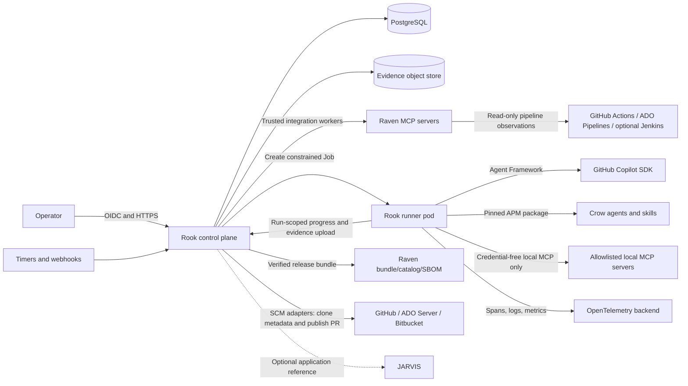
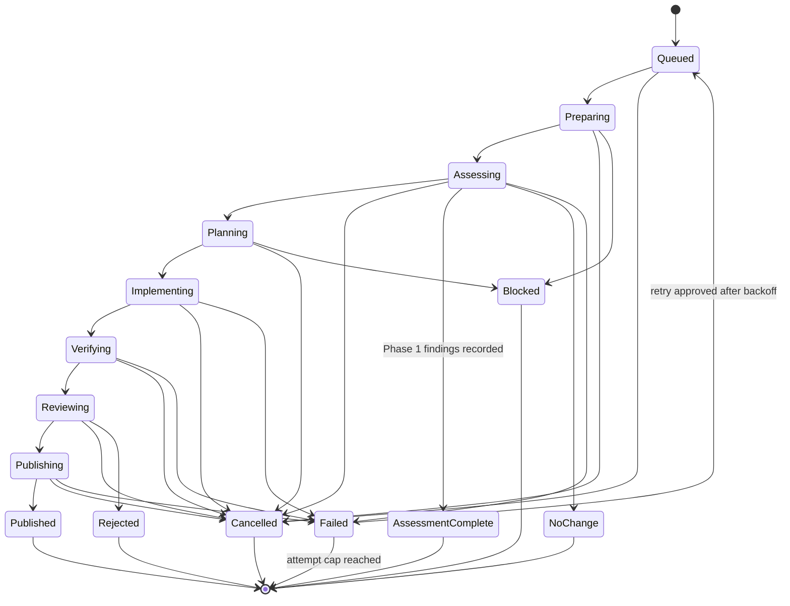
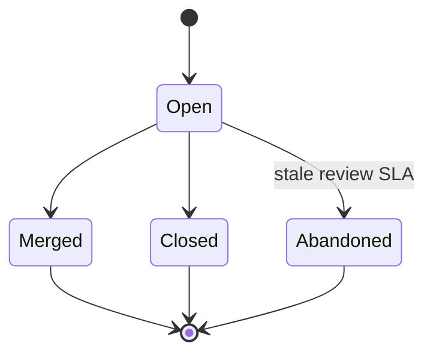
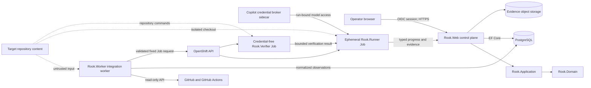

# Rook Orchestration Framework Solution Architecture

**Status:** Proposed<br>
**Date:** 2026-09-27<br>
**Initial scale:** 25-100 repositories with continuous daily maintenance<br>
**Target initial autonomy (Phase 2):** Create draft pull requests; humans approve and merge<br>
**Phase 1 autonomy:** Read-only assessment; no repository or pipeline mutation<br>
**System of record:** Rook owns orchestration state and optionally references JARVIS application records

**Related documents:** [Plan overview](./orchestration-framework-plan.md) |
[UX design](./orchestration-framework-ux-design.md) |
[Implementation tasks](./orchestration-framework-tasks.md)

This document is authoritative for system boundaries, components, workflows,
data, security, hosting, reliability, testing strategy, risks, and technical
decisions. Operator interaction behavior belongs in the UX design. Work order,
task status, and implementation verification belong in the task plan.

**External baseline reviewed:** Crow `main` and Raven `main` on 2026-09-27.
The implementation must pin a released Crow package and an attested Raven
bundle rather than treating either repository's moving branch as a runtime
dependency. Current public baseline examples are Crow `v0.9.3` and Raven suite
`0.1.0`; these are evidence of the packaging contracts, not an approval to
ship those exact versions. Raven's release-bundle/catalog contract is still a
pre-stable integration surface: revalidate the suite and per-server versions,
catalog schema, platform support, attestation, and security status at
implementation time.

## 1. Executive recommendation

Build Rook as a .NET 10 modular monolith from one solution, deployed in four
role-isolated forms:

1. a control-plane web/API deployment that owns repository state, scheduling,
   policy, the operator experience, and audit evidence;
2. trusted integration/publisher workers with SCM and CI/CD provider access,
   including Raven-backed integrations, but no target-repository execution;
3. an ephemeral agent runner with a credential broker sidecar; and
4. a separate credential-free verifier Job for all repository-controlled
   command execution.

Use Microsoft Agent Framework workflows for explicit agent and function
composition, but keep correctness-critical control flow in deterministic C#.
Use the GitHub Copilot SDK as the first agent backend behind an interface so
local OpenShift-hosted models and Azure-hosted agents can be added later.
Install a pinned Crow APM package in each runner image. Install and verify the
complete Raven bundle as a unit, then configure and expose only the selected,
allowlisted Raven servers/tools from the trusted integration worker. Runners
receive normalized source-control and pipeline observations as immutable
snapshots.

Model two independent provider assignments for every application:

- an **SCM provider** for source, branches, commits, and pull requests:
  GitHub first, followed by on-premises Azure DevOps Server and later
  Bitbucket; and
- zero or more **CI/CD pipeline providers**: GitHub Actions first, followed by
  Azure DevOps Pipelines and later Jenkins for the subset of applications that
  use it.

The MVP starts with GitHub for SCM, pull requests, and GitHub Actions.
On-premises Azure DevOps Server and Azure DevOps Pipelines follow closely once
the MVP is running. Bitbucket and Jenkins remain later adapters behind the same
contracts.

Host the MVP in **OpenShift Emerald with a single PostgreSQL instance inside
the cluster**. Emerald's SDN integration and stronger network isolation fit
Rook's requirement that runner, verifier, control-plane, database, and
integration-worker paths be explicitly allowlisted. Gold's default-allow
network-policy posture is not suitable for Rook's MVP security baseline.
Keep the in-cluster database deliberately simple for the proof-of-value, with
documented backup/restore and data-loss limitations. After the MVP proves
functional and operational viability, migrate PostgreSQL to an external
VM-hosted service through a tested expand/migrate/contract procedure.

Do not make unattended scheduling generally available until a feasibility
spike proves that a developer-owned GitHub Copilot subscription can be used
securely, reliably, and within applicable licensing and usage limits from the
chosen runner environment. A run must bind to an explicit operator credential
profile. Expired, revoked, or exhausted credentials must fail closed and place
the run in `Blocked`, never silently switch identity or model.

## 2. Goals and non-goals

### 2.1 Goals

- Maintain applications that have already completed a developer-led Crow
  modernization and onboarding review.
- Detect and remediate framework currency, dependency currency, and feasible
  security issues.
- Create evidence-backed draft pull requests for human review.
- Support scheduled, event-triggered, and manually initiated runs.
- Keep durable per-repository state, findings, decisions, run history, and
  evidence.
- Support both manual priority decisions and explainable scored priority.
- Read each application's configured CI/CD provider state and normalize it into
  the application status record; the MVP starts with GitHub Actions.
- Support GitHub repositories and GitHub Actions independently, followed
  closely by on-premises Azure DevOps Server and Azure DevOps Pipelines.
- Make agent, model, Crow, Raven, workflow, and policy versions reproducible
  for every run.
- Preserve a provider-neutral workflow policy so later agent backends can be
  added without rewriting orchestration policy.

### 2.2 Non-goals for the MVP

- Autonomous merge, deployment, production mutation, or CI/CD pipeline
  configuration/execution.
- Bringing an unmodernized application directly into unattended maintenance.
- Treating model output, an MCP response, or an agent's claim as verification.
- General-purpose infrastructure automation.
- Cross-repository code changes in one run.
- Long-term semantic memory or agents that modify their own skills or code.
- Making JARVIS the persistence store for Rook execution state.

## 3. Architecture principles

1. **Deterministic code owns the workflow.** Agents make bounded judgments;
   C# enforces sequence, policy, retries, budgets, acceptance criteria, and
   external-state verification.
2. **One agentic step, one judgment.** Separate discovery, planning,
   implementation, review, and explanation into typed steps.
3. **Evidence before state transition.** Builds, tests, scans, diff limits, and
   remote PR state are checked by code before a run can advance.
4. **The sandbox is the security boundary.** Prompt rules, tool allowlists,
   working directories, and MCP validation are defense in depth, not
   containment.
5. **Least capability per run.** Give each runner only the repository,
   credentials, Raven tools, network routes, and time it needs.
6. **Human control at consequential boundaries.** The MVP may open a draft PR
   but may not approve, merge, deploy, trigger or mutate CI/CD pipelines, or
   dismiss a security finding.
7. **Durable state is explicit.** Agent session history, workflow state,
   business state, and audit evidence have different lifetimes and storage
   rules.
8. **Every artifact is attributable.** Draft PRs, commits, comments, and reports
   identify Rook automation and the responsible run.
9. **Provider independence is deliberate, not universal.** Keep agent backend,
   SCM, and CI/CD provider contracts separate. Do not hide useful PostgreSQL,
   Azure DevOps Server, GitHub, Bitbucket, OpenShift, or Agent Framework
   behavior behind lowest-common-denominator abstractions.
10. **Unicode is end-to-end.** Repository names, owner names, findings,
    evidence, prompts, logs, reports, and database fields preserve Unicode and
    use UTF-8 interchange. Identifier security rules are separate from
    user-supplied display text.
11. **Common capabilities before custom code.** Describe the capability first,
    search the current B.C. common-component catalogue, DevHub, and existing
    ministry capabilities, then record reuse, adaptation, or build with owner,
    support, data, accessibility, availability, cost, roadmap, and exit-path
    evidence. Absence from one catalogue is `Unknown`, not proof of absence.
12. **GaaP and architecture guardrails are enforceable.** GaaP here means
    Government as a Platform, not accounting GAAP. Prefer secure defaults,
    explicit contracts, least privilege, accessibility, observable and reversible
    changes, bounded resource use, clear ownership, and deterministic
    validation. These are acceptance criteria at each boundary, not a
    retrospective checklist.
13. **Zero Trust applies to every protected operation.** Network location,
    prior authentication, repository ownership, branch state, model intent,
    or a Raven response never establishes authorization. Evaluate subject,
    action, resource, workload evidence, context, assurance, scope, duration,
    revocation, enforcement, telemetry, and time-bound exceptions explicitly.

These principles align with Crow's separation of agent decisions, routed skill
knowledge, stable templates, and deterministic scripts. They also incorporate
the strongest transferable ideas from NVIDIA's Object Oriented Agents project:
ordinary code remains the control plane, model-visible capabilities are narrow,
claims are verified outside the model, and the complete call tree is traced.

## 4. System context



### 4.1 Trust boundaries

- **Human boundary:** Operators authenticate through the approved corporate
  identity provider. Authorization is enforced by Rook, not by UI visibility.
- **Control-to-runner boundary:** A runner receives an immutable signed run
  envelope containing IDs, policy, versions, budgets, a nonce, an expiry, and
  signing-key ID. It cannot select a different repository or workflow. A
  narrow run-scoped identity lets it report only its own progress and upload
  bounded evidence; it cannot write business state directly.
- **Repository boundary:** Repository content, issues, build scripts, package
  metadata, and instructions files are untrusted input and may contain prompt
  injection or executable code.
- **MCP boundary:** Raven responses are untrusted data. Credential-bearing
  Raven servers run in the trusted integration boundary, not the repository
  sandbox. A runner may use only explicitly approved credential-free local MCP
  servers.
- **Provider boundary:** SCM and CI/CD are separate trust and authorization
  boundaries. A source repository may use a different CI/CD platform, and
  access to one never implies access to the other.
- **Model boundary:** Prompts and source may leave the Rook environment through
  the configured provider. Onboarding must record and enforce the repository's
  data-boundary policy before any source, prompt, issue, log, or provider
  observation is submitted. The policy must specify classification, residency,
  permitted model providers, prohibited content classes, redaction mode, and
  expiry; missing, stale, or incompatible policy evaluation fails closed.
- **Database boundary:** `Rook.Web` and the trusted `Rook.Worker` are the only
  application workloads that write the database. Both use the same
  application persistence boundary, but separate least-privileged database
  credentials and network policies. A dedicated migration identity owns DDL;
  the worker is limited to required business-state, observation, outbox, and
  lease operations. Runners have no database network path or credential.

## 5. Logical components

Start with one solution and enforce boundaries in projects. Do not create
separate network services for these modules until scaling or governance
requires it.

```text
src/
  Rook.Web/                 ASP.NET Core control-plane API and operator UI
  Rook.Application/         use cases, workflows, policies, scoring
  Rook.Domain/              state machines, entities, invariants
  Rook.Infrastructure/      EF Core, repository providers, MCP, telemetry
  Rook.AgentFramework/      Agent Framework and agent-backend adapters
  Rook.Worker/              trusted integration and publication worker
  Rook.Runner/              isolated per-run executable
  Rook.Verifier/            credential-free command executor
  Rook.Contracts/           versioned run envelopes and external contracts
tests/
  Rook.UnitTests/
  Rook.IntegrationTests/
  Rook.ArchitectureTests/
  Rook.EndToEndTests/
```

### 5.1 Control plane

Responsibilities:

- repository onboarding and policy management;
- manual run submission and operator cancellation;
- periodic scheduling and webhook/event intake;
- priority calculation and queue selection;
- durable run state, leases, idempotency, and recovery;
- OpenShift Job creation from an approved template;
- credential-profile selection by reference;
- operator UI/API, approvals, holds, and audit history;
- a fleet-wide pause/kill switch and review-capacity budgets;
- reconciliation of draft PRs and CI/CD pipeline state;
- trusted SCM publication and CI/CD observation workers;
- health, metrics, and administrative reporting.

The web and scheduler processes never clone target repositories or hold a
writable working tree. A separately permissioned publisher worker may create a
short-lived clean checkout solely to revalidate and publish an approved patch.
The integration worker may read provider metadata using a read-only application
credential.

### 5.2 Runner

Responsibilities:

- validate the signed run envelope and report readiness for the control plane's
  run lease;
- create a fresh, single-repository workspace;
- connect to run-scoped credential brokers without receiving their underlying
  secret values;
- install/use the exact pinned Crow and credential-free local MCP versions in
  the runner image;
- execute the selected Agent Framework workflow;
- enforce time, token, tool-call, process, CPU, memory, disk, and output limits;
- perform deterministic verification;
- submit an immutable patch, publication request, and evidence when all gates
  pass;
- submit each full typed step output through the run-scoped API; the control
  plane validates its contract version and envelope before persisting the
  payload and hash;
- flush telemetry and evidence, report terminal status, and exit.

Each attempt gets a new pod and workspace. No Copilot session, MCP client,
working tree, shell process, or mutable tool instance is shared between
concurrent runs.

The control plane, not the sandbox, publishes the draft PR. It revalidates the
target revision, publication key, patch hash, and verification evidence before
using a repository-scoped credential. The runner never receives a repository
write token or CI/CD provider credential.

### 5.3 Agent backend boundary

Define an application-owned interface such as `IAgentBackend` around the
capabilities Rook needs:

- create a run-scoped agent session;
- execute a typed agent step;
- stream structured progress events;
- report usage and model identity;
- cancel and dispose the session.

Initial implementation is a Copilot SDK adapter using
`Microsoft.Agents.AI.GitHub.Copilot`. Do not design or implement local,
Azure/Foundry, or multi-backend routing until a later phase has a measured
need and an approved provider contract.

Do not abstract MCP, tools, or provider-specific configuration prematurely.
Store the backend type and provider-specific, non-secret configuration as a
versioned policy document. Workflows consume Rook's typed step interface rather
than a provider SDK directly.

### 5.4 Crow integration and package lifecycle

Crow is a governed package of agents, routed skills, detection modules,
templates, and deterministic scripts. The package separates knowledge from
execution: agents own decisions and failure behavior, skills route only the
needed context, modules hold optional policy, templates hold stable output
shapes, and scripts perform repeatable validation, rendering, packaging, and
release work.

**Production delivery**

- Build the runner image from a versioned Crow APM package (or a reviewed
  integrity-checked archive) at image-build time. The current public package
  example is `bcgov/crow#v0.9.3`; resolve the approved version through release
  policy and record its ref, archive digest, and content manifest.
- Prefer a locally packed Crow archive with its recorded SHA-256, or pin the
  APM CLI version and installer digest as part of the image build. Never run a
  moving `aka.ms/apm-*` installer or install from an unlocked moving ref in a
  production build.
- Use the `copilot` APM target for Rook's Copilot-backed runner. The Copilot
  CLI plugin is a useful local-development option, not a reason to install or
  update packages at run time.
- Keep the package cache and client profile separate from any Crow checkout.
  Do not run `apm update`, plugin installation, or arbitrary package resolution
  in a production runner. Updates are explicit, reviewed, canaried, and
  rollbackable.
- Resolve a Rook workflow manifest to exact agent, skill, module, template, and
  deterministic-script versions. Record the manifest, Crow package version,
  content digest, and selected capability list in every run and published PR.
- Do not load skills, agents, hooks, or executable configuration from a target
  repository. A repository `crow.config` may provide public project-memory
  references only; it never grants tools, credentials, policy authority, or
  trust.

Crow owns the agent and skill catalogue, routing rules, module contents,
templates, deterministic scripts, and maintainer workflows. Rook must not
reproduce that catalogue or its internal routing logic. Rook stores only a
versioned workflow manifest that selects an approved Crow capability and
records its package/content digest. Maintainer-only package, release, Raven
setup, and agent/skill authoring workflows are not available to ordinary
target-repository remediation runs.

**Agent update policy**

- Treat Crow changes as dependency changes with targeted unit, contract,
  sandbox, and representative-repository evaluation in Crow's release
  process; Rook's gate is to verify the approved package/content digest and
  run its representative compatibility suite.
- Prove in Phase 0 that the selected Microsoft Agent Framework/Copilot SDK
  path can discover the approved immutable Crow package. The exact adapter
  packaging remains an implementation detail of the selected SDK path.
- Canary changes against finding fingerprints, evidence schemas, report
  formats, generated business-rule identifiers, and reviewer acceptance before
  fleet rollout.
- Use the Crow release policy for semantic version classification and explicit
  approval of major releases. Keep the prior package and manifest available for
  immediate rollback.
- Use cross-family/model review only as an independent quality signal; it never
  replaces deterministic gates or human approval for consequential writes.

### 5.4.1 Raven release-bundle integration

Raven is an integration adapter and MCP server suite, not Rook's workflow
engine. Rook consumes only the selected, allowlisted Raven capabilities from
Raven's verified release-bundle contract. Raven owns its server catalog,
package layout, launchers, protocol details, tool inventory, authentication
mechanisms, and release process.

Rook's integration contract is limited to:

- verify the approved bundle provenance and content digest before provisioning;
- generate a Rook-owned configuration for explicitly selected servers;
- run credential-bearing servers only in the trusted integration worker;
- pass noninteractive provider credentials through the platform secret
  manager, never through runners, prompts, or repository content;
- authorize each tool call independently of Raven metadata or model intent;
- record bundle/configuration provenance and fail closed when a required
  capability, credential, or authorization decision is unavailable.

Raven's autonomous pipeline is not part of Rook's MVP. Rook owns orchestration,
state, policy, verification, publication, and reconciliation. Any Raven
server capability gaps required by a provider contract are tracked and
implemented in Raven, then consumed by Rook after contract validation.

### 5.4.2 Common components and GaaP decision record

Rook is proposed as a **Shared platform** (`Inferred`). Its intended
consumers are application owners, maintainers, reviewers, and platform
operators across the 25-100 repository portfolio. The product owner, service
owner, support objective, capacity commitment, and consumer onboarding path
remain `Unknown` until confirmed. Provider adapters are internal Rook modules;
they do not change Rook's single platform-role classification.

Rook owns orchestration state and evidence; it is not the canonical register
for application inventory, source control, pipeline state, identity, secrets,
or telemetry. JARVIS, SCM providers, CI/CD providers, the approved identity
provider, and platform services retain their respective authority. A
one-to-many change to a Rook contract requires compatibility analysis,
consumer notification, capacity review, support ownership, and a rollback
path.

Before building a Rook capability, record:

1. the capability without naming a product;
2. the B.C. common-component catalogue, DevHub, and existing ministry
   capabilities searched, with review date and search boundary;
3. candidate owner, eligibility, support, privacy/security, accessibility,
   availability, cost, roadmap, contract, and exit path;
4. the decision to reuse, adapt behind a Rook-owned adapter, or build, with
   confidence `Verified`, `Inferred`, `Unknown`, or `N/A`;
5. the data custodian, purpose, subject/tenant scope, sharing class (`open`,
   `shared`, or `closed`), retention, and minimum fields;
6. the contract owner, compatibility/versioning policy, migration sequence,
   rollback path, and dependency degradation behavior.

Initial candidates to evaluate are corporate identity and step-up assurance,
secrets and workload identity, OpenShift ingress and job execution, managed
PostgreSQL/backup, object storage, queues/outbox, OpenTelemetry, centralized
logging/alerting, image registry/signing/SBOM, notification, accessibility
components, and approved repository/pipeline integrations. A candidate is
not selected merely because it is common; it must satisfy the workload's
security, data, availability, support, and exit requirements.

### 5.5 SCM and CI/CD integrations

SCM and CI/CD are independent per-application assignments. Do not infer the
pipeline provider from the source host or require both to use the same system.

Define an `ISourceControlProvider` contract for:

- repository and default-branch metadata;
- immutable commit lookup and archive/clone acquisition;
- branch and pull-request discovery;
- scoped branch publication and draft pull-request creation;
- pull-request status, comments, reviews, and reconciliation.

Implement providers in this order:

1. **GitHub** for the MVP;
2. **On-premises Azure DevOps Server** immediately after the MVP is running;
3. **Bitbucket** later.

Define a separate `IPipelineProvider` contract for read-only observation:

- pipeline/job identity and configured source reference;
- latest and recent runs, state, result, timestamp, duration, and URL;
- source branch and commit correlation where available;
- test summaries, artifacts metadata, and change information;
- narrowly targeted, redacted failed-run log retrieval;
- provider observation time, freshness, and collection error.

Implement pipeline providers in this order:

1. **GitHub Actions** for the MVP;
2. **Azure DevOps Pipelines** immediately after the MVP is running;
3. **Jenkins** later for the subset of applications that use it.

An application can have zero, one, or multiple configured pipeline bindings.
For example, source can be in Bitbucket while a Jenkins job builds it, or source
can be in GitHub while Azure DevOps Pipelines performs deployment. Each binding
records its role, such as validation, build, security scan, or deployment. The
MVP observes existing runs and never triggers, stops, promotes, or reconfigures
a pipeline.

Raven is one implementation of the provider adapters described above. Its
selected servers run in the trusted integration worker and are subject to the
same read-only allowlist, contract tests, freshness rules, and explicit
unavailable/stale states. Raven-specific packaging, tool inventory, and
capability extensions remain in Raven; Rook does not invoke Raven's autonomous
pipeline or scrape provider UIs.

Runner-local MCP servers are limited to credential-free analysis such as code
indexing; they must not hold SCM, CI/CD, Rook database, or control-plane
credentials.

Normalize every provider into a common `PipelineStatusSnapshot` while retaining
provider-specific extension data:

- provider type, server/organization/project, and canonical pipeline identity;
- binding role and required/optional status;
- source branch and revision when available;
- latest run identity, URL, state/result, timestamp, and duration;
- last successful and last failed run;
- test totals and failures when exposed;
- queue/running state where exposed;
- observation time, freshness, collection error, and adapter/tool version.

Do not persist full pipeline logs by default. They can contain credentials and
personal information. For diagnosis, retain a redacted excerpt as short-lived
evidence and keep the source URL. An unavailable, unconfigured, or
inaccessible provider produces an explicit `NotConfigured`, `Unavailable`,
`Unknown`, or `Stale` status as appropriate; it must not be reported as healthy
or treated as proof that the application has no CI/CD.

### 5.6 JARVIS integration

Rook owns automation policy and execution state. A repository may optionally
store a JARVIS application ID. Rook may read business criticality, owner, and
technology metadata through a read-only JARVIS integration, but it snapshots
the values used for a priority decision so later JARVIS changes do not rewrite
history.

Rook must continue operating when JARVIS is unavailable. A missing required
criticality or ownership value blocks onboarding or prioritization according to
policy rather than silently assigning a benign default.

## 6. Workflow design

### 6.1 Run and change-proposal state machines

A run is bounded by one automation attempt series and ends with a read-only
assessment result or, in later phases, when a proposal is published. Human
review is a separate, potentially long-lived lifecycle owned by
`ChangeProposal`.





Every transition is:

- validated against the current state;
- written with optimistic concurrency;
- accompanied by a timestamp, actor, reason, and evidence references;
- safe to retry using the applicable identity key;
- emitted through an outbox event in the same transaction.

`AssessmentComplete` is the successful Phase 1 terminal when the read-only
assessment records one or more findings with versioned typed outputs and
evidence. It does not authorize planning, implementation, publication, or any
repository mutation. `NoChange` is the successful terminal when the assessment
finds no actionable work. `Published` is available only to Phase 2 and later
workflows.

Use two identities:

- **Run deduplication key:** repository + target commit + ordered set-hash of
  finding fingerprints + workflow version + policy version. A partial unique
  constraint applies only to non-terminal runs, so duplicate triggers join the
  active attempt series while an authorized manual re-trigger can create a new
  series after a terminal outcome.
- **Publication key:** repository + ordered set-hash of finding fingerprints +
  workflow version. A unique constraint allows at most one open proposal for
  the same problem, even when the default branch advances. A second uniqueness
  rule permits each finding to belong to at most one open proposal, preventing
  overlapping sets such as `{A}` and `{A,B}`.

Resume means deterministic replay from durable, typed outputs of completed
steps. Implementation and verification restart in a fresh runner after
infrastructure failure. The MVP does not restore opaque shell processes,
worktrees, model context, or agent sessions. Agent Framework checkpoint storage
is ephemeral to an attempt unless a later security review approves encrypted,
redacted cross-pod checkpoint persistence.

`Rejected` means the independent review rejected publication. The finding stays
open and backoff applies. Attempt accounting distinguishes:

- **Cap-consuming functional attempts:** model/implementation failure,
  deterministic verification failure, and independent-review rejection.
- **Bounded infrastructure retries:** runner/verifier provisioning failure,
  transient network/provider failure, and other platform errors. These use a
  separate retry budget and do not consume the finding's functional cap.
- **Non-attempt outcomes:** operator cancellation, policy hold/block, or
  `PauseAll`. They do not retry until their explicit release condition occurs.
- **Publication retries:** retry from the stored immutable patch without
  re-running the agent and use a separate bounded publication retry budget.

`Blocked` requires a defined release condition and owner. An abandoned proposal
is reconciled, its branch is cleaned up according to policy, and its findings
remain open.

### 6.2 Standard maintenance workflow

1. **Preflight (deterministic)**
   - Confirm repository eligibility, maintenance window, no active hold, and no
     open Rook PR with the same publication key or a policy-defined overlapping
     path set.
   - Resolve exact target commit and acquire a repository lease.
   - Resolve credential, Crow, Raven, model, workflow, and policy versions.
   - Confirm credential health and remaining usage budget.
   - Enforce `maxAttemptsPerFinding` (default 3), exponential backoff, repository
     and owner PR caps, and the fleet-wide daily publication budget. Route an
     exhausted finding to `NeedsHuman`.
2. **Observe (deterministic with read-only integrations)**
   - Refresh SCM, framework, dependency, security, and all configured CI/CD
     pipeline observations in trusted integration workers.
   - Deduplicate findings by stable fingerprint.
3. **Triage (agent judgment with typed output)**
   - Classify applicability, likely impact, and candidate action.
   - Code validates all cited files, versions, alerts, and external references.
4. **Plan (agent judgment with typed output)**
   - Produce bounded changes, expected files, migration risk, verification
     commands, and rollback notes.
   - Policy rejects plans outside the workflow's authority.
5. **Implement (Copilot/Crow in sandbox)**
   - Modify only the isolated workspace.
   - Keep Copilot's first-party shell/file/URL tools disabled. Rook-controlled
     workspace and MCP tools are deny-by-default and authorized against the run
     envelope.
   - Run all repository-defined, package-manager, restore, build, test, scan,
     and generated commands only in the credential-free verifier Job. Any local
     runner command tool is limited to fixed Rook-authored operations that do
     not load or execute repository content.
6. **Verify (deterministic)**
   - Confirm diff scope and size, no forbidden files, no generated secrets, and
     no unrelated changes.
   - Run repository-declared restore/build/test/lint/security commands with
     explicit timeouts.
   - Require non-vacuous results: expected test discovery, scan inputs, and
     artifacts must exist.
7. **Independent review (separate agent session)**
   - Review the diff, evidence, risk, and original finding without inheriting
     the implementation session's mutable state.
   - Deterministic code validates review references.
   - Treat the review as advisory evidence. It never substitutes for
     deterministic verification and may use a different approved model when
     this measurably reduces correlated failure.
8. **Publish**
   - Submit the patch and publication request to the trusted publisher.
   - Revalidate target revision, publication uniqueness, diff policy, and
     evidence before pushing a Rook branch and creating the draft PR.
   - Create a draft PR clearly labelled as automated.
   - Include finding, changes, evidence, residual risks, rollback, run ID,
     versions, and links to retained evidence.
   - Once the first remote write starts, record cancellation as pending, finish
     creating/reconciling the proposal, then close it if cancellation still
     applies. Retry a transient publication failure from the stored patch.
9. **Reconcile**
   - Poll or receive provider events for PR updates.
   - Record human review, merge/close outcome, and subsequent configured CI/CD
     pipeline results.
   - Reopen or create a follow-up finding when post-merge validation fails.
   - Sweep for Rook-authored branches or PRs without matching state and either
     adopt or clean them up through an audited operator-visible action.

### 6.3 Initial workflow catalogue

| Workflow | Trigger | Scope | Minimum evidence |
| --- | --- | --- | --- |
| Framework currency | cadence, EOL horizon, manual | supported patch/minor first; major by policy | framework inventory, release/EOL source, build and tests |
| Dependency currency | cadence, security alert, manual | one coherent package group | lockfile diff, vulnerability audit, build and tests |
| Security remediation | confirmed finding, manual | supported Crow finding types | source evidence, data-flow evidence, security tests, independent review |
| CI/CD status refresh | cadence, manual | all configured pipeline bindings | normalized snapshots with source timestamps and explicit unconfigured/unavailable states |
| Repository health refresh | cadence, provider event | metadata only | target revision, branch protection, CI and open Rook PR state |

Run discovery separately from remediation. A discovery failure must not erase or
close an existing finding. A finding is closed only by deterministic evidence
or an explicit human decision.

## 7. Per-repository state

### 7.1 Core records

**Repository**

- optional JARVIS application ID;
- owners, business criticality, data classification, and support tier;
- enabled workflows, cadence, maintenance window, concurrency limit;
- allowed agent backends/models and a versioned data-boundary policy containing
  permitted providers, residency requirements, prohibited content classes,
  source/prompt redaction mode, effective/expiry timestamps, and fail-closed
  behavior;
- credential-profile references, never credential values;
- build/test/scan commands and expected-result contracts;
- branch/PR policy, maximum diff, forbidden paths, required reviewers, reviewer
  notification route, per-repository open-PR cap, and weekly new-PR cap;
- onboarding status, last successful snapshot, and next eligible run.

**SourceRepositoryBinding**

- SCM provider (`AzureDevOpsServer`, `GitHub`, or `Bitbucket`);
- server/base URL, collection/organization/workspace, project, immutable
  provider repository ID, display name, URL, and default branch;
- read credential profile, publication credential profile, provider capability
  flags, webhook configuration, and last successful reconciliation;
- exactly one active source binding per Rook repository in the MVP.

**PipelineBinding**

- pipeline provider (`AzureDevOpsPipelines`, `GitHubActions`, or `Jenkins`);
- server/organization/project and immutable pipeline/job/workflow identity;
- role (`Validation`, `Build`, `SecurityScan`, or `Deployment`), branch/ref
  mapping, required/optional status, and freshness threshold;
- read credential profile, provider-specific configuration, and last successful
  observation;
- zero or more bindings per repository, independent of the source binding.

**WorkflowManifest**

- immutable version and content digest;
- workflow graph and typed contract versions;
- Crow, local MCP, backend, model, runner image, and deterministic-tool pins;
- tool/command/URL/network allowlists and default budgets.

**CredentialProfile**

- ID, credential type, secret-manager or broker reference, owner, approved
  repositories/workflows, expiry, rotation status, and entitlement/quota class;
- no secret value, OAuth refresh token, or API token.

**ReviewTeam and FleetPolicy**

- owner/team identity, repository assignments, notification route, reviewers,
  open-PR cap, weekly review capacity, and escalation path;
- versioned fleet daily publication budget, global concurrency, `PauseAll`,
  default attempt/retry budgets, and change-approval history.

**ObservationSnapshot**

- immutable SCM, dependency, framework, security, and normalized CI/CD provider
  facts;
- source revision, collection time, source/tool version, freshness, and errors.

**Finding**

- stable fingerprint based on provider-independent rule ID, repository-relative
  location/subject, and normalized evidence identity; tool version is excluded;
- fingerprint aliases/migrations, type, source, title, description, evidence;
- severity, confidence, affected versions/paths, first/last observed;
- status, owner, suppression/acceptance reason and expiry;
- risk score inputs/version, automation-eligibility inputs/version, and latest
  decisions;
- links to attempts, PRs, alerts, and replacement findings.

**Run and RunStep**

- trigger, requested actor, credential profile, repository/target commit;
- workflow/policy/Crow/Raven/backend/model/image versions;
- state transitions, leases, retries, budgets, usage, timing, and errors;
- bounded, pre-redacted versioned typed summaries persisted through the
  control-plane reporting API, payload hashes, and evidence references for each
  step; raw untrusted inputs/outputs and secret-bearing payloads are never
  persisted.

**Attempt**

- run/attempt-series identity, runner and verifier Job identities, start/end;
- functional, infrastructure, publication, cancellation, or policy outcome;
- normalized failure taxonomy, retry/backoff decision, and whether the outcome
  contributes to the finding's functional attempt cap.

**ChangeProposal**

- publication key, ordered finding set, branch, commits, diff hash,
  verification results, review result;
- draft PR identity/state, human reviews, merge/close result;
- post-merge SCM and configured CI/CD pipeline observations.

**AuditEvent**

- append-only actor, action, target, time, correlation ID, decision, and
  before/after hashes; sensitive payloads are excluded.

### 7.2 State lifetimes

- **Ephemeral:** model context, shell processes, worktree, MCP clients, and
  unredacted command output, including Agent Framework attempt checkpoints.
  Destroy with the runner.
- **Durable operational:** run state, typed step summaries, immutable
  observations, full typed step outputs or evidence-store references, evidence
  hashes, PR references, scores, and audit events.
- **Retained evidence:** redacted logs, test/scan reports, diffs, and traces
  under a documented retention schedule.

## 8. Prioritization

### 8.1 Risk score and automation eligibility

Calculate and persist an explainable 0-100 `RiskScore` from a versioned formula:

| Factor | Weight | Examples |
| --- | ---: | --- |
| Security severity and exploitability | 45 | confirmed severity, reachability, known exploitation, exposure |
| Framework/platform support horizon | 25 | unsupported runtime, approaching EOL, missed security patch |
| Business criticality | 20 | JARVIS/Rook criticality, public service impact |
| Finding age and SLA status | 10 | first observed, SLA breach, accepted-risk expiry |

Rules:

- P0: 90-100, P1: 75-89, P2: 50-74, P3: 25-49, P4: 0-24.
- A confirmed critical remotely exploitable issue has a P0 floor.
- An internet-facing unsupported framework has at least a P1 floor.
- Risk does not include fix confidence, test health, credential availability, or
  previous automation failures.
- Missing or stale inputs reduce score confidence and may block automation;
  they do not become zero-valued benign inputs.
- Persist each factor, source snapshot, formula version, risk score, confidence,
  and calculation time.

Calculate a separate versioned `AutomationEligibility` decision (`Eligible`,
`NeedsHuman`, or `Blocked`) and confidence from:

- supported workflow and bounded change;
- clean or understood baseline from every required configured CI/CD binding;
- reliable build/test/scan contracts;
- prior attempt outcomes and current backoff;
- credential, quota, maintenance-window, and sandbox availability;
- target revision and conflicting-proposal state.

Low fix confidence or repeated failure never lowers visible risk. It changes
automation eligibility. After the configured attempt cap, set `NeedsHuman` and
stop automatic retries until a human changes the finding or workflow state.

### 8.2 Manual priority

Support three modes:

- `Automatic`: priority comes from the current score.
- `ManualOverride`: an operator sets P0-P4 and optional rank.
- `Hold`: excluded from execution until a date/event or explicit release.

An override or hold requires reason, actor, timestamp, owner, and review/expiry
date. Rook keeps displaying the risk score beside the effective manual
priority so risk is not concealed. Expired overrides return to automatic mode
after notifying the owner.

Queue order is:

1. safety or regulatory hard floors;
2. effective priority bucket;
3. manual rank within the bucket;
4. risk score;
5. SLA age;
6. oldest eligible run time.

Only `Eligible` work enters the automatic queue. Repository concurrency,
maintenance windows, credential/model quotas, attempt backoff, existing or
overlapping Rook PRs, `maxOpenRookPrsPerRepo`,
`maxNewRookPrsPerRepoPerWeek`, per-owner review capacity, and the fleet-wide
daily PR budget are eligibility gates, not risk factors. An administrator can
activate `PauseAll`, which prevents new runner and publication work while
leaving status collection and the operator UI available.

## 9. Persistence and reliability

Use PostgreSQL with EF Core migrations and provider-specific integration tests.
Recommended patterns:

- optimistic concurrency tokens on mutable records;
- database leases with heartbeat and expiry for repository/run ownership;
- `FOR UPDATE SKIP LOCKED` or an equivalent safe claim pattern for work
  selection;
- transactional outbox for job creation, notifications, and reconciliation;
- partial unique active-run deduplication constraints, one-open-proposal
  publication-key constraints, and one-open-proposal-per-finding membership;
- immutable observation/evidence records with hashes;
- partition or archive high-volume step and telemetry metadata;
- automated backups, point-in-time recovery, restore tests, and defined RPO/RTO.

Keep Rook's business state machine authoritative even if Agent Framework
checkpointing or the Durable Extension is used. Framework checkpoint data is an
execution aid, not the only record of why an action occurred.

Microsoft's Durable Extension supports self-hosted durable workflows, but its
current C# package path and Durable Task Scheduler dependencies must be proven
from OpenShift, including networking, data residency, preview-package policy,
operational ownership, checkpoint encryption/redaction, and recovery behavior.
The MVP persists only Rook's typed step outputs and database-backed state
machine across pods. Adopt cross-pod Agent Framework checkpoints or the Durable
Extension only if the spike demonstrates a clear reliability benefit without
introducing an unapproved Azure control-plane dependency or retaining
unredacted model/tool context.

## 10. Security and safety controls

### 10.1 Identity and authorization

- Corporate OIDC for operators.
- Roles: `Viewer`, `Operator`, `Maintainer`, and `Administrator`.
- Resource-level authorization for repository, credential profile, workflow,
  manual priority, evidence, and cancellation operations.
- Evidence is classified as `Internal`, `Confidential`, or `Restricted`.
  Viewers may download only `Internal` evidence; Operators may download
  `Internal` and `Confidential` evidence when repository policy grants that
  scope; Maintainers may access those classes and `Restricted` evidence only
  with explicit purpose, approval, and step-up authentication; Administrators
  may use the same audited approval path for `Restricted` evidence. These
  rules are enforced server-side and are not inferred from the UI.
- Separate credentials for:
  1. Copilot/model access;
  2. SCM read and repository clone/archive acquisition;
  3. SCM branch/pull-request publication;
  4. read-only CI/CD provider observation through Raven or direct adapters;
  5. Rook database access.
- Prefer short-lived provider tokens for repository operations where supported.
  Never reuse the Copilot identity as the repository write credential merely
  for convenience.
- Provider adapters own provider-specific token types, scopes, rotation
  mechanics, and revocation procedures. Rook requires separate read and
  publication identities, least available scope, expiry visibility, and
  repository/project authorization for every adapter.
- Store secret references in Rook and values in the platform secret manager.
  Never place secrets in prompts, run envelopes, logs, evidence, or database
  JSON. A deterministic `SensitiveDataGuard` must scan and redact or reject
  payloads before database, object-store, trace, audit, or log persistence;
  scanning failures fail closed.

### 10.1.1 Zero Trust decision record

Rook treats operators, runners, repositories, Crow agents, model output, Raven
responses, provider APIs, and platform workloads as distinct subjects or
untrusted resources. For each representative high-impact path, document the
following record before enabling it:

| Protected operation | Subject and workload evidence | Resource/action | Required assurance; exception owner/expiry | Enforcement, scope, and duration | Degradation, revocation, and telemetry | Evidence status |
| --- | --- | --- | --- | --- | --- | --- |
| Operator starts, cancels, holds, or overrides a run | OIDC subject, role, repository authorization, device/session evidence | Run, repository, evidence, or policy mutation | Step-up where required; named approver for exceptions and expiry | Rook API/resource authorization; one operation and short-lived session scope | Deny or hold on unknown policy; audit actor, reason, correlation ID, and evidence | `Verified` after an authorization test; otherwise `Unknown` |
| Control plane creates a runner/verifier Job | Rook workload identity, validated template, approved namespace and policy version | One run attempt and its bounded resources | Signed envelope assurance; exception owned by platform operator and time-bound | Namespace-scoped service account, fixed template, nonce, audience, expiry | Reject replay or template drift; emit creation/termination decision and cleanup result | `Verified` by template and replay tests |
| Runner reports progress or evidence | Audience-restricted run identity and envelope hash | Only its own run's progress and bounded evidence | Run-scoped workload assurance; no standing exception | Control-plane API validates subject, run, contract version, size, and hash | Reject stale/expired/mismatched reports; retain provenance without secrets | `Verified` by contract and scope tests |
| Integration worker reads or publishes provider state | Provider-specific workload credential, repository binding, operation policy | Minimum repository/PR/pipeline resource and read/write action | Stronger publication assurance; exception owner is the operator and has an expiry | Provider API plus Rook allowlist; publication requires a fresh target revision and human-approved policy | Queue or block on provider outage; revoke/rotate credentials and record provider, scope, freshness, and result | `Inferred` until provider drills pass |
| Agent invokes a tool or external decision | Run-scoped agent identity, approved Crow/Raven manifest, tool policy | Exact tool, arguments, target path/resource, and call budget | Run policy assurance; any override is named, justified, and expires | Deny-default hook plus server-side argument/resource validation | Hard-fail unknown/ambiguous authorization; record decision reason and redacted provenance | `Verified` by adversarial approval tests |
| Raven server accesses an upstream system | Integration-worker identity and configured endpoint | Selected server capability and minimum provider query | Provider credential assurance; exception owner/expiry recorded in policy | Raven schema/tool boundary plus Rook per-run allowlist; no arbitrary URLs | Fail closed or mark stale/unavailable; rotate/revoke credentials and retain source timestamp | `Unknown` until each provider path is tested |

Network location, VPN presence, repository ownership, branch state, prior
authentication, or a model instruction is context only; none is proof of
authorization. All exceptions are owned, justified, compensating, monitored,
and time-bound. Runtime events use stable reason codes and correlation IDs,
not raw tokens, prompts, hidden reasoning, or unnecessary personal data.

### 10.2 Copilot permission policy

Microsoft Agent Framework's Copilot integration delegates tool approval to the
Copilot SDK's native pre-tool hook. Rook must own one reviewed hook that:

- defaults to deny;
- allows only the run's command/path/URL/MCP policy;
- handles every `ApprovalRequiredAIFunction`;
- cannot be replaced by target repository configuration;
- records each decision without sensitive arguments;
- treats an unknown tool or approval type as a hard failure.

The feasibility spike must test the warning that a custom `OnPreToolUse` hook
replaces the integration's default approval hook. Automated tests must prove
that destructive and out-of-scope tools remain denied.

### 10.3 Runner containment

The runner and verifier boundaries described in section 5.2 are mandatory
security properties. OpenShift manifests and platform runbooks own the
provider-specific pod, namespace, quota, security-context, network-policy,
deadline, cleanup, and Job-controller settings.

Rook's acceptance criteria are:

- each attempt gets a fresh immutable execution boundary and workspace;
- repository-controlled commands run only in the separate credential-free
  verifier Job, never in the control plane or agent runner;
- neither the runner nor verifier may use host mounts, a container socket, or
  an ambient/default service-account token; workload identity is short-lived,
  audience-restricted, and explicitly projected;
- the runner has no provider write, Raven, database, or administrative
  credentials. Copilot access is brokered and scoped to the run;
- the verifier has no route to the control plane, Copilot broker, model
  credentials, repository/provider credentials, database, or integration
  workers, and holds no signing or reporting credential;
- verifier egress is deny-by-default. Repository-controlled commands cannot use
  arbitrary DNS, HTTP, HTTPS, redirects, alternate IP representations, IPv6
  paths, or proxy bypasses;
- dependency acquisition uses a trusted prefetch process or an approved,
  immutable registry/proxy allowlist with controlled DNS, certificate, protocol,
  and redirect policy. Any exception is explicitly recorded and covered by the
  containment test suite.
- the control plane creates runner and verifier Jobs only from a fixed,
  server-owned template with validated parameters; repository content cannot
  choose a privileged workload or namespace;
- model-visible tools are deny-by-default and independently authorized;
- cancellation, deadline, evidence extraction, cleanup, and replay rejection
  are observable and tested.

### 10.4 Prompt injection and untrusted content

- Keep system/workflow policy immutable and separate from repository data.
- Pass source, issues, MCP output, and logs through data parameters, not by
  interpolation into trusted instructions.
- Ignore repository instructions that request broader credentials, different
  tools, disabled verification, or policy changes.
- Validate every agent citation against the actual target commit or external
  source.
- Sanitize model-authored PR text and links.
- Never execute newly created agent/skill definitions from the target repo in
  the same run.

### 10.5 Supply chain

- Pin the .NET SDK, NuGet lock files, Crow APM package, Raven release bundle,
  Raven catalog, container base image, security scanners, and deterministic
  scripts.
- Verify Crow archive integrity and Raven archive SHA-256, manifest, source
  commit, SBOM digest, and artifact attestation before promotion. Generate and
  retain SBOMs for runner, control-plane, and integration-worker images.
- Scan images and dependencies before promotion.
- Fail when a checker did not actually inspect expected inputs or when the
  catalog/configuration/package digest does not match the approved manifest.
- Record image digest, Crow ref/content digest, Raven suite/platform/source
  commit/catalog/archive/SBOM digests, selected server list, and package/tool
  versions in each run.

### 10.6 Data and telemetry

- Use structured logs, correlation/run IDs, metrics, and OpenTelemetry traces
  across control plane, workflow, agent step, model call, tool call, command,
  and provider operation.
- Apply deterministic sensitive-data detection and redaction before persistence
  and again before export. Reject secret-bearing payloads when they cannot be
  safely redacted, and fail closed when scanning is unavailable. Do not retain
  hidden model reasoning.
- Store typed summaries and required evidence, not unlimited transcripts.
- Define retention by evidence class and support legal hold/deletion policy.
- Test UTF-8/Unicode round trips through UI, API, PostgreSQL, queue state, MCP
  data, PR content, logs, and exports, including combining marks and Indigenous
  language characters.

## 11. Hosting options

### 11.1 Evaluation criteria

Scores use 1 (poor) to 5 (strong). Weighting reflects unattended execution of
untrusted repository code across 25-100 repositories. These are provisional
decision aids; platform owners must validate capacity, recovery, and network
policy assumptions before production.

| Criterion | Weight | OpenShift Emerald + in-cluster PostgreSQL | OpenShift Emerald + external VM PostgreSQL |
| --- | ---: | ---: | ---: |
| Per-run isolation and least privilege | 25% | 5 | 5 |
| Network isolation and policy control | 20% | 5 | 4 |
| Initial implementation simplicity | 20% | 5 | 2 |
| Deployment consistency and rollback | 10% | 5 | 4 |
| Operational resilience and recovery | 15% | 2 | 4 |
| Scale and concurrency | 10% | 3 | 5 |
| **Weighted score** | **100%** | **4.35** | **3.95** |

The MVP choice prioritizes Emerald's SDN-backed isolation and implementation
simplicity. The external database becomes the target once measured workload,
recovery objectives, and operational ownership justify the migration. Cost,
platform onboarding, backup service, and RPO/RTO remain decision gates rather
than invented assumptions.

### 11.2 Option A: OpenShift Emerald with in-cluster PostgreSQL

**Strengths**

- A fresh pod is a natural OS-level isolation boundary for each run.
- Emerald SDN integration supports explicit deny-by-default network policy
  between the control plane, runners, verifiers, database, and integrations.
- Resource quotas, deadlines, security contexts, and namespace-scoped
  identities are platform capabilities.
- Runner concurrency can grow independently of the control plane.
- Immutable images and deployment manifests improve reproducibility and
  rollback.
- Linux containers fit the widest range of modern repository build tooling.
- A single PostgreSQL instance provides the MVP state store and queue/lease
  primitives without adding an external network dependency.

**Risks and mitigations**

- A single database instance is a deliberate availability and recovery
  limitation: document backup/restore, retention, recovery tests, and
  acceptable data-loss limits before onboarding.
- Creating Jobs requires Kubernetes API authority: use a namespace-scoped
  control-plane service account and a fixed validated Job template.
- Copilot user authentication in ephemeral containers is unproven: complete the
  authentication/licensing spike before selecting the production credential
  flow.
- Package restore uses a trusted prefetch process or an approved immutable
  registry/proxy allowlist. The verifier has no arbitrary internet or DNS
  egress, and redirects, alternate IPs, IPv6 paths, and proxy bypasses are
  denied and covered by the containment test suite.
- OpenShift operations require platform skills: provide runbooks, dashboards,
  quotas, and tested failure recovery before onboarding critical repositories.

**Database choice**

Use PostgreSQL for Rook. Do not support MSSQL in the MVP; supporting both
providers would double migration, locking, query, and test paths without user
value. Exchange data with JARVIS through its API/MCP contract, not
cross-database joins.

### 11.3 Option B: OpenShift Emerald with external VM-hosted PostgreSQL

This is the target topology after MVP proof, not an MVP prerequisite.

**Strengths**

- Separates stateful database operations from the cluster's initial
  single-instance failure domain.
- Provides a clearer path to managed backup, PITR, monitoring, capacity, and
  recovery objectives.
- Preserves Emerald for runner isolation and network enforcement.

**Migration requirements**

- Define the external PostgreSQL owner, TLS/authentication, backup/PITR,
  monitoring, RPO/RTO, retention, and restore-test obligations.
- Rehearse an expand/migrate/contract migration with consistency checks,
  quiescence or dual-write strategy as appropriate, rollback, and a bounded
  maintenance window.
- Switch only after MVP evidence demonstrates that the operational benefits
  outweigh the added network dependency and migration complexity.

### 11.4 Decision

**Preferred MVP: OpenShift Emerald with a single PostgreSQL instance inside
the cluster.**

Emerald's SDN integration and stronger network isolation are required because
Rook intentionally executes repository-controlled build and test code under
model direction. OpenShift Gold's default-allow network-policy posture is not
compatible with the MVP security baseline. The in-cluster database keeps the
first implementation and operations simple while the MVP proves the
orchestration model.

The MVP database is a deliberate single-instance availability trade-off, not
the target production topology. It requires documented backup/restore,
migration, retention, and data-loss limits. Once the MVP has demonstrated
functional correctness, security controls, operational recovery, and measured
load, migrate to an external VM-hosted PostgreSQL service. The migration is an
expand/migrate/contract change with rehearsal, rollback, and an explicit
owner; it is not a prerequisite for the first pilot.

The MVP onboarding gate requires Linux-compatible build and verification.
Windows-only/.NET Framework repositories are deferred to a separately isolated
Windows runner pool in a later phase; they must not be marked maintainable when
Rook cannot execute their required verification.

### 11.5 Capacity and entitlement model

Size the platform from measured pilot values, not repository count alone:

```text
agent runs/day =
  eligible repositories x average maintenance findings per repository/day

required average concurrency =
  (agent runs/day x p75 run duration) / scheduling window

requested quota =
  (peak runner concurrency x runner resources) +
  (peak verifier concurrency x verifier resources)

Copilot demand =
  agent runs/day x p75 prompts/model calls per run, including retries

sustainable open PRs =
  reviewers x PRs reviewed per reviewer/week x average review lifetime in weeks
```

The initial quota worksheet must model status-only runs separately because
SCM and CI/CD status refreshes do not require Copilot. Phase 0 measures wall
time, model calls, premium requests/tokens where available, verifier resources,
artifact volume, and retry rate on representative repositories. Phase 1
requests quota for the GitHub/GitHub Actions pilot plus a defined burst/retry margin and accounts
for whether the runner remains resident while verifier Jobs execute.
Repository, owner, and fleet publication budgets derive from measured reviewer
throughput and target review lifetime. An individual developer entitlement is
not assumed sufficient for Phase 3 or 4; those phases require an approved
organizational/enterprise entitlement and named budget owner based on measured
daily demand.

## 12. Observability and operations

### 12.1 Required signals

- Queue depth and age by priority/workflow.
- Eligible, blocked, held, running, failed, and no-change runs, plus open,
  merged, closed, and abandoned change proposals.
- Run duration and step duration.
- Agent/model/tool calls, retries, denials, usage, and budget exhaustion.
- Runner creation latency, pod failures, timeouts, and cleanup failures.
- Build/test/scan result and non-vacuous verification failures.
- Draft PR creation rate, human acceptance rate, time to review, merge rate,
  rework rate, and post-merge failure rate.
- Review-agent rejection/disagreement rate and agreement with human review.
- Open Rook PRs and new PRs by repository, owner, and fleet budget; reviewer
  notification delivery and backlog age.
- Finding age, recurrence, suppression expiry, and score-confidence gaps.
- CI/CD snapshot freshness, collection failures, and coverage by provider and
  required binding.
- Credential expiry/revocation without exposing credential material.

### 12.2 Health behavior

- Liveness checks only process health.
- Readiness checks database connectivity, migration compatibility, and required
  platform integrations without causing cascading failures.
- An unavailable agent backend, SCM provider, CI/CD provider, or Raven server
  degrades only the affected repositories/workflows and creates explicit
  blocked/unavailable/stale states; it does not make the whole UI unavailable.
- Bounded queues and per-repository/global concurrency limits provide
  backpressure.
- `PauseAll` stops new automation and publication immediately without hiding
  current state; repository/owner/fleet PR budgets stop reviewer overload.
- Operator cancellation propagates to workflow, SDK, MCP calls, child
  processes, and OpenShift Job deletion.

### 12.3 Service objectives proposed for pilot

- No more than one open draft PR for a repository, ordered finding set, and
  workflow publication key.
- No finding belongs to more than one open draft PR.
- 100% of published PRs link to deterministic verification evidence.
- 100% of consequential tool requests have an audit decision.
- Stale run lease detected and recovered or blocked within 15 minutes.
- Required CI/CD binding status freshness under 24 hours for enabled
  repositories; repositories without a configured binding explicitly report
  `NotConfigured`.
- 99% of terminal runs have complete flushed traces and state transitions.

Set availability, RPO/RTO, retention, and response-time targets with platform
owners before production. The values above are pilot acceptance targets, not a
production SLA.

## 13. Phase 0 and Phase 1 detailed solution architecture

This section resolves the Phase 0 and Phase 1 deployment, project, request,
data, contract, reliability, and degradation design. The executable work and
phase gates are maintained in the
[implementation tasks](./orchestration-framework-tasks.md).

### 13.1 Confirmed scope and working decisions

| Decision | Selected value | Status | Consequence or revisit trigger |
| --- | --- | --- | --- |
| Pilot UX boundary | End-to-end operator console: portfolio, repository onboarding/detail, run detail/evidence, holds, and overrides | `Confirmed` 2026-09-27 | Phase 1 is not complete with an API-only or single-run screen |
| UI implementation | ASP.NET Core Razor Pages with progressive enhancement | `Confirmed` 2026-09-27 | JavaScript may enhance filtering and status refresh, but navigation, forms, validation, and status remain usable without it |
| Operator roles | `Viewer`, `Operator`, `Maintainer`, `Administrator` with the matrix in the [UX design](./orchestration-framework-ux-design.md#4-role-and-control-matrix) | `Confirmed` 2026-09-27 | Resource authorization is enforced server-side; hiding a control is not authorization |
| Phase 0 code | Disposable spike projects under `spikes/`, using only non-production repositories and identities | `Confirmed` by roadmap | No spike assembly is referenced by a Phase 1 production project |
| Phase 1 repository effect | Read source and GitHub Actions state only | `Confirmed` by exit gate | Branch pushes, commits, workflow dispatch, comments, labels, and pull requests are denied and contract-tested |
| Phase 1 UI style source | Current B.C. Design System tokens and released component guidance, reviewed 2026-09-27 | `Provisional` | Recheck package versions and released components when T006 is executed |
| Phase 1 identity | Corporate OIDC through the approved workforce identity service | `Provisional` | Client, claim mapping, group owners, MFA assurance, and outage policy must be confirmed before pilot access |
| Durable workflow | Rook state machine and typed outputs in PostgreSQL | `Confirmed` by architecture | Agent Framework checkpointing stays attempt-local unless the Phase 0 comparison proves a safe operational benefit |

### 13.2 Phase 0 and Phase 1 solution architecture

#### 13.2.1 Deployment and trust-boundary view



The diagram is directional, not a network-policy substitute. The verifier has
no route to the control plane, broker, provider APIs, database, or evidence
store. It returns results through an OpenShift-owned bounded exchange selected
and validated by the runner. The control plane cannot execute repository
content. In Phase 1 the integration worker has provider read permission only.

#### 13.2.2 Production project boundaries

| Project | Owns | May reference | Must not reference |
| --- | --- | --- | --- |
| `Rook.Domain` | entities, value objects, state transitions, invariants, domain events | .NET base libraries | EF Core, ASP.NET Core, provider or agent SDKs |
| `Rook.Application` | use cases, ports, authorization requirements, command/query validation | `Rook.Domain`, `Rook.Contracts` | delivery frameworks and concrete infrastructure |
| `Rook.Contracts` | versioned run envelopes, typed step outputs, evidence and provider contracts | serialization primitives | domain persistence models or SDK DTOs |
| `Rook.Infrastructure` | EF Core, PostgreSQL, GitHub, OIDC support, object storage, OpenTelemetry adapters | Domain/Application ports, Contracts | Razor Pages or runner process control |
| `Rook.AgentFramework` | `IAgentBackend`, Agent Framework workflow adapter, Copilot adapter | Application ports, Contracts | web UI and provider publication |
| `Rook.Web` | Razor Pages, API endpoints, session edge, antiforgery, composition root | Application, Infrastructure composition | direct provider SDK calls or repository execution |
| `Rook.Worker` | outbox dispatch, provider refresh, reconciliation, trusted publication in later phases | Application, Infrastructure, Contracts | Razor UI and agent execution |
| `Rook.Runner` | one run attempt, approved agent workflow, budgets, typed reporting | AgentFramework, Contracts | database access and provider write credentials |
| `Rook.Verifier` | fixed command-plan execution and bounded result production | Contracts | model, database, provider, Raven, or control-plane clients |

`Rook.ArchitectureTests` enforces these edges. Phase 0 spike projects are
standalone and cannot be referenced from `src/`.

#### 13.2.3 Phase 0 spike architecture

Each spike produces a runnable probe, automated checks for its safety claim,
raw redacted measurements, and a short decision record. Spikes share only
version pins and test fixtures; they do not grow into a parallel production
architecture.

| Spike | Input | Required output | Go condition | No-go condition |
| --- | --- | --- | --- | --- |
| Copilot entitlement and broker | approved non-production operator profile and Emerald namespace | authentication-mode matrix, revocation/expiry/exhaustion behavior, concurrent-session result, cost model at 25/100 repositories | policy owner approves unattended use and a run-bound broker flow; measured budget is supportable | licensing prohibits the flow, identity cannot be bounded to a run, or failure silently changes identity/model |
| Permission hook | exact SDK integration and deny-default policy | allow/deny decision log and automated unknown-tool/replacement-hook tests | every unlisted tool and out-of-scope argument fails closed | repository content can replace policy, invoke built-in shell/file/URL tools, or receive secrets |
| Crow/Raven/provider | pinned candidate Crow archive, attested Raven bundle, pilot GitHub repository | digest verification, manifest resolution, selected-server config, normalized provider snapshots, rollback test | immutable packages reproduce and provider contract has explicit unavailable/stale outcomes | moving dependency, unverified bundle, missing contract data, or implicit success on outage |
| Workflow durability | typed assess-plan-verify fixtures and PostgreSQL | replay comparison and checkpoint decision | Rook can resume from persisted typed outputs without opaque model state | recovery requires persisted hidden/model/tool context or an unapproved control plane |
| Sandbox | adversarial fixture repositories and fixed Job templates | containment test report for filesystem, network, process, secret, identity, and resource limits | all escape attempts are denied and cleanup is observable | any cross-boundary access, ambient credential, uncontrolled process, or unbounded resource use |

The Phase 0 decision record uses `Go`, `Conditional go`, or `No-go` for every
row. A conditional go names the owner, due date, measurable release condition,
and a control that prevents Phase 1 from bypassing it.

The workflow-durability decision is also a Phase 1 planning gate. If T038
recommends cross-pod framework checkpoint persistence, stop before T050 and
revise the Phase 1 schema, threat model, retention controls, and tasks. Do not
silently add checkpoint storage while executing the typed-output design below.

#### 13.2.4 Phase 1 control-plane request flow

1. A signed-in operator submits a Razor Page form with antiforgery protection.
2. `Rook.Web` maps the request to an Application command; the command contains
   the subject, resource identifier, correlation ID, and idempotency key.
3. An authorization handler evaluates role, repository scope, operation, and
   current resource state. Denials return a stable reason code and are audited.
4. The Application handler validates invariants and commits business changes,
   an audit event, and an outbox record in one PostgreSQL transaction.
5. `Rook.Worker` claims outbox work with a lease. For assessment it refreshes
   read-only provider observations, resolves immutable run configuration, and
   asks the fixed OpenShift Job factory to create a runner.
6. The runner validates the signed envelope, executes typed assessment steps,
   submits bounded outputs, and exits. No repository-controlled command is
   needed for the Phase 1 read-only assessment; if a declared observation
   requires execution, the run is `Blocked` rather than broadening authority.
7. The worker reconciles Job and provider state. The UI reads materialized
   queries and exposes source/freshness, pending, stale, unavailable, blocked,
   cancelled, failed, `NoChange`, and `AssessmentComplete` outcomes distinctly.

If a runner terminates without its final report, reconciliation uses the Job
condition, last heartbeat, cancellation request, and a configurable termination
grace period. It records a terminal platform or cancellation reason rather
than leaving the run indefinitely pending; it never fabricates completed
assessment evidence.

Every mutation is POST-redirect-GET. Refreshing a result page cannot repeat a
command. A duplicate idempotency key returns the original command result.

#### 13.2.5 Data ownership and minimum schema

| Aggregate/table | Minimum fields and invariants | Retention role |
| --- | --- | --- |
| `RepositoryProfile` | ID, display name, SCM binding, default branch, CI/CD bindings, enabled workflows, toolchain facts, eligibility, row version | business state until offboarding plus required audit retention |
| `RepositoryAuthorization` | repository ID, subject/group reference, allowed actions, effective/expiry timestamps | current access plus audit history |
| `PolicyVersion` | immutable JSON document, schema version, digest, effective time, superseded-by | retain while referenced by any run |
| `PackageProvenance` | Crow/Raven name, version, source ref, SHA-256, attestation result, approved/rollback status | retain while referenced and for evidence period |
| `Run` | repository, workflow, target SHA, state, reason code, attempt, policy/package/model/credential references, timestamps, row version | pilot evidence retention; duration remains a production decision |
| `RunStep` | run, step type, contract version, status, bounded pre-redacted summary, payload reference/hash, started/completed times | same as run; raw or secret-bearing payloads never persist and large payload stays outside ordinary logs |
| `ProviderObservation` | repository, provider/binding, normalized state, source ID, observed-at, fetched-at, freshness state, payload hash | latest plus history needed to explain runs |
| `Finding` | stable fingerprint, source, severity, applicability, state, first/last seen | until resolved plus audit retention |
| `Hold` | scope, reason, owner, start, optional expiry/release condition, active flag | active plus history |
| `ManualPriority` | repository/run scope, P0-P4, optional rank, reason, actor, expiry | active plus history |
| `EvidenceItem` | run, kind, media type, byte count, object key, SHA-256, source, classification (`Internal`, `Confidential`, or `Restricted`), created time, publication-scan result | object retention policy; class-aware authorization and restricted-content handling are mandatory; never stores a secret-bearing URL |
| `AuditEvent` | actor/workload, action, resource reference, outcome/reason, correlation, occurred-at | append-only; privacy-minimized |
| `OutboxMessage` | type, aggregate, payload version, occurred/available/processed times, attempt and error code | delete/archive only after proven processing retention |
| `Lease` | resource, owner, acquired/expiry times, fencing token | transient; fencing token must increase |

PostgreSQL uses UTF-8. Protocol identifiers and digests use ordinal comparison;
display text preserves supplied Unicode. Search normalization, collation, and
retention periods remain provisional until the accountable owners confirm
them; Phase 1 tests must still cover combining marks, syllabics, and
supplementary-plane characters.

#### 13.2.6 HTTP and UI contract

| Method and route | Purpose | Minimum role | Idempotency/failure behavior |
| --- | --- | --- | --- |
| `GET /` | portfolio status | Viewer | read-only; states include stale and unavailable |
| `GET /repositories/new` / `POST /repositories` | onboarding review and create | Maintainer | POST idempotency key; duplicate provider binding is a validation error |
| `GET /repositories/{id}` | repository state, policy, pipeline, runs, holds | Viewer with repository scope | not-found and unauthorized are not distinguished to an unscoped subject |
| `POST /repositories/{id}/refresh` | read-only provider refresh | Operator | joins active equivalent refresh |
| `POST /repositories/{id}/assessments` | start manual read-only assessment | Operator | joins matching active run deduplication key |
| `GET /runs/{id}` | run timeline, configuration, evidence | Viewer with repository scope | payload absence is explicit, not rendered as success |
| `POST /runs/{id}/cancel` | request cancellation | Operator | safe to repeat; returns current cancellation state |
| `POST /repositories/{id}/holds` / `POST /holds/{id}/release` | create/release hold | Operator | requires reason and release condition/expiry |
| `POST /repositories/{id}/priority` | set expiring manual priority | Operator | requires reason; preserves prior value in audit |
| `POST /admin/pause` / `POST /admin/resume` | fleet-wide safety control | Administrator | confirmation, reason, current-state check, and audit required |
| `GET /evidence/{id}` | authorized evidence download | repository scope plus evidence-class authorization | short-lived server-streamed attachment with allowlisted media type, `X-Content-Type-Options: nosniff`, no active-content rendering, and no object-store URL exposure; denied when publication scanning or integrity checks fail |

Phase 1 does not expose provider publication endpoints. The GitHub adapter
interface has separate read and write ports; only the read implementation is
registered.

Phase 1 supports onboarding and manual read-only provider refresh, but defers
repository offboarding, provider-binding edits, policy editing, and role-mapping
administration. OIDC claim/group-to-role mappings are externally provisioned
and validated configuration for the pilot; they are not editable through the
operator console. The deferred operations require explicit contracts,
authorization, audit, UX, and tests before production use.

#### 13.2.7 Reliability, telemetry, and degradation

- Use optimistic concurrency on aggregates and fencing tokens on leases.
- Use a transactional outbox; workers are at-least-once and handlers are
  idempotent. Poison messages become operator-visible `Blocked` work after the
  bounded retry policy.
- Propagate cancellation and deadlines. A UI cancellation request is not shown
  as complete until the worker/Job reaches a terminal state.
- Liveness checks only the process. Readiness checks required configuration,
  database connectivity, migration compatibility, and the ability to claim
  work; optional provider outages do not restart the control plane.
- Emit structured logs, traces, and metrics keyed by correlation and run ID,
  never raw tokens, prompts, repository content, or evidence payloads.
- Render provider data with `Observed at` and `Fetched at`. Past the configured
  freshness threshold, label it `Stale`; provider failure is `Unavailable`,
  never green/healthy.
- Back up the single in-cluster database and execute a restore drill before
  pilot exit. Record the measured RPO/RTO and the owner who accepts the MVP
  limitation.

### 13.3 Related delivery specifications

- The [UX design](./orchestration-framework-ux-design.md) defines the operator
  information architecture, screens, states, responsive behavior, and WCAG 2.2
  Level AA acceptance.
- The [implementation tasks](./orchestration-framework-tasks.md) define the
  Phase 0/1 checklist, dependencies, independent tests, exit gates, and
  later-phase roadmap.

## 14. Testing strategy

- **Unit:** state transitions, invariants, scoring, eligibility, permission
  decisions, redaction, idempotency, and retry classification.
- **Architecture:** dependency direction and forbidden project references.
- **Integration:** PostgreSQL concurrency/leases/outbox/migrations; GitHub/GitHub
  Actions first, followed by ADO,
  Bitbucket, Azure DevOps Pipelines, Jenkins/Raven, secret
  manager, and OpenShift adapters using test doubles or approved test systems.
- **Provider combinations:** contract cases where SCM and CI/CD differ,
  including GitHub/GitHub Actions for the MVP, followed by GitHub/Azure DevOps
  Pipelines and Bitbucket/Jenkins, plus a repository with no pipeline binding.
- **Contract:** typed Agent Framework outputs, MCP schemas, run envelope,
  provider webhooks, and PR payloads.
- **Sandbox/adversarial:** path escape, symlink, process fork, resource
  exhaustion, secret probing, prompt injection, egress escape, and malicious
  build/test scripts.
- **End-to-end:** disposable repositories covering no-change, successful draft
  PR, verification failure, cancellation, crash/resume, stale target commit,
  duplicate event, credential expiry, missing CI/CD binding, ADO/GitHub
  Actions/Jenkins outage, inaccessible pipeline provider, and SCM provider
  outage.
- **Evaluation:** fixed repository scenarios scored for finding precision,
  patch correctness, diff scope, test quality, reviewer acceptance, and
  regression. Run canaries before changing Crow, model, prompt, or workflow
  versions.
- **Unicode:** create/read/update/search/sort where applicable, API/MCP transit,
  PR publication, logs, and export round trips with combining marks,
  syllabics, and supplementary-plane characters.

## 15. Key risks and decisions

| Risk | Impact | Treatment |
| --- | --- | --- |
| Developer Copilot subscription is unsuitable for unattended/server use | Blocks initial backend | Phase 0 licensing/auth spike; fail closed; retain backend abstraction |
| Target repo prompt injection or malicious build code | Credential/data compromise | Per-run pod, no ambient secrets, egress policy, data/instruction separation |
| Agent claims verification that did not occur | Unsafe PR | Deterministic non-vacuous gates and evidence hashes |
| Tool approval hook is misconfigured | Excess authority | Single reviewed deny-default hook and adversarial tests |
| Shared credentials leak across runs | Cross-repo compromise | Run-scoped clients, brokered Copilot access, and repository credentials confined to the trusted publisher |
| Duplicate or stale PRs | Reviewer noise/incorrect change | leases, target SHA checks, idempotency, provider reconciliation |
| Security score hides hard-to-fix critical work | Risk becomes invisible | separate risk and automation eligibility; severity floors |
| CI/CD provider is absent, stale, unavailable, or inaccessible | False health report | independent pipeline bindings, source timestamps, freshness, and explicit `NotConfigured`/`Unavailable`/`Unknown`/`Stale` |
| SCM and CI/CD provider are incorrectly assumed to match | Missed builds or wrong authorization | separate provider contracts, credentials, bindings, and contract tests |
| Crow/model upgrade changes behavior | Fleet regression | pinned versions, evaluation suite, canary rollout, rollback |
| Single in-cluster database failure | MVP orchestration outage/state loss | Explicit availability trade-off, backups, restore tests, retention, and a tested migration trigger to external PostgreSQL |
| OpenShift control plane can create arbitrary Jobs | Namespace compromise | fixed template, validated parameters, scoped service account |
| Agent Framework/Durable packages evolve | Rework or lock-in | package pinning, adapter boundary, Rook-owned state machine |

## 16. Decisions to confirm during implementation

These do not change the recommended architecture, but must be resolved before
production:

- approved identity provider/client and Rook role owners;
- GitHub organization/repository credential mechanisms, app/bot identity, and
  GitHub Actions permissions;
- ADO Server collection/project, PAT scopes, rotation, project authorization,
  and bot identity for the follow-on integration;
- Copilot unattended-use approval, entitlement/budget owner, and per-operator
  credential lifecycle;
- MVP PostgreSQL owner, backup/restore owner, retention, and acceptable
  single-instance data-loss window;
- external VM-hosted PostgreSQL owner, HA topology, RPO/RTO, and migration
  trigger after MVP proof;
- OpenShift namespaces, quotas, egress destinations, and image promotion path;
- evidence object store, telemetry backend, and evidence retention/classification;
- representative GitHub-hosted pilot repositories and GitHub Actions workflows;
- sequencing and test environments for ADO, Bitbucket, Azure DevOps Pipelines,
  and Jenkins adapters;
- target portfolio toolchain inventory and Windows-runner demand;
- production priority formula thresholds and manual override approvers.

## 17. Sources reviewed

### Microsoft and GitHub

- [Microsoft Agent Framework overview](https://learn.microsoft.com/en-us/agent-framework/overview/?pivots=programming-language-csharp)
- [Microsoft Agent Framework GitHub Copilot integration](https://learn.microsoft.com/en-us/agent-framework/integrations/by-component/agent-services/github-copilot?pivots=programming-language-csharp)
- [Microsoft Agent Framework Durable Extension](https://learn.microsoft.com/en-us/agent-framework/hosting/azure-functions?pivots=programming-language-csharp)
- [GitHub Copilot SDK](https://github.com/github/copilot-sdk)

### Crow and Raven

- [Crow](https://github.com/bcgov/crow)
- [Crow README: agents, skills, APM/plugin packaging, and release process](https://github.com/bcgov/crow/blob/main/README.md)
- [Crow package manifest](https://github.com/bcgov/crow/blob/main/apm.yml)
- [Crow application-architecture principles](https://github.com/bcgov/crow/tree/main/.apm/skills/crow-application-architecture)
- [Crow platform alignment](https://github.com/bcgov/crow/blob/main/.apm/skills/crow-application-architecture/modules/platform-alignment.md)
- [Crow Zero Trust guidance](https://github.com/bcgov/crow/blob/main/.apm/skills/crow-application-architecture/modules/zero-trust.md)
- [Crow solution-architecture common-component guidance](https://github.com/bcgov/crow/blob/main/.apm/skills/crow-solution-architecture/modules/bc-common-components.md)
- [Crow security-review modules](https://github.com/bcgov/crow/tree/main/.apm/skills/crow-security-review/modules)
- [Crow project context skill](https://github.com/bcgov/crow/blob/main/.apm/skills/crow-project-context/SKILL.md)
- [Crow Raven delivery and update guidance](https://github.com/bcgov/crow/tree/main/.apm/skills/crow-raven-setup)
- [Raven](https://github.com/bcgov/raven)
- [Raven packaging and releases](https://github.com/bcgov/raven/blob/main/docs/RELEASES.md)
- [Raven tool inventory](https://github.com/bcgov/raven/blob/main/docs/TOOL_INVENTORY.md)
- [Raven system design and architecture](https://github.com/bcgov/raven/blob/main/docs/SYSTEM_DESIGN_AND_ARCHITECTURE.md)
- [Raven release server catalog](https://github.com/bcgov/raven/blob/main/release/server-catalog.json)
- [Raven autonomous DevOps pipeline](https://github.com/bcgov/raven/blob/main/packages/pipeline/AUTONOMOUS_DEVOPS_PIPELINE.md)
- [Raven Azure DevOps MCP](https://github.com/bcgov/raven/tree/main/packages/ado-mcp)
- [Raven Jenkins MCP](https://github.com/bcgov/raven/blob/main/packages/jenkins-mcp/README.md)
- [B.C. government common components catalogue](https://digital.gov.bc.ca/technology/common-components/)
- [B.C. common components background and Government as a Platform](https://bcgov.github.io/common-components-wiki/background)

### NVIDIA Object Oriented Agents

Repository reviewed at commit
[`5acb147`](https://github.com/NVIDIA-NeMo/labs-OO-Agents/tree/5acb1470371398481c2339f70af91699c7df2ab3).

- [Architecture](https://github.com/NVIDIA-NeMo/labs-OO-Agents/blob/5acb1470371398481c2339f70af91699c7df2ab3/docs/architecture.md)
- [Orchestration](https://github.com/NVIDIA-NeMo/labs-OO-Agents/blob/5acb1470371398481c2339f70af91699c7df2ab3/docs/concepts/orchestration.md)
- [Safety](https://github.com/NVIDIA-NeMo/labs-OO-Agents/blob/5acb1470371398481c2339f70af91699c7df2ab3/docs/concepts/safety.md)
- [Tracing](https://github.com/NVIDIA-NeMo/labs-OO-Agents/blob/5acb1470371398481c2339f70af91699c7df2ab3/docs/concepts/tracing.md)
- [Multi-agent systems](https://github.com/NVIDIA-NeMo/labs-OO-Agents/blob/5acb1470371398481c2339f70af91699c7df2ab3/docs/concepts/multi-agent-systems.md)
- [Prompts and context](https://github.com/NVIDIA-NeMo/labs-OO-Agents/blob/5acb1470371398481c2339f70af91699c7df2ab3/docs/concepts/prompts-and-context.md)

### JARVIS in Azure DevOps

Reviewed the `dev` branch of the ECON/JARVIS/JARVIS repository, including:

- `README.md`;
- `docs/architecture-index.md`;
- `docs/jarvis-api/architecture.md`;
- `docs/executive-report.md`;
- `azure-pipelines.yml`;
- `src/Jarvis.Api/Jarvis.Api.csproj`;
- `src/Jarvis.Api/Program.cs`.
