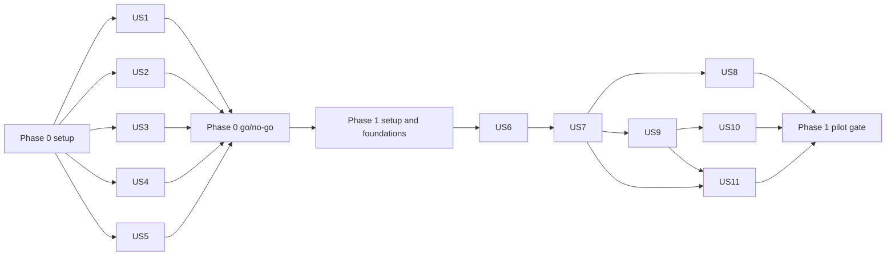

# Rook Orchestration Framework Implementation Tasks

**Status:** Proposed 
**Date:** 2026-09-27 
**Scope:** Phase 0 feasibility and Phase 1 manual read-only pilot

## 1. Purpose and authority

This document is the canonical implementation checklist for Phase 0 and
Phase 1. The
[solution architecture](./orchestration-framework-solution-architecture.md)
owns technical decisions and boundaries. The
[UX design](./orchestration-framework-ux-design.md) owns operator interactions
and accessibility behavior. The
[main plan](./orchestration-framework-plan.md) is the concise entry point.

A task is not complete merely because code exists. Its named verification must
pass and its evidence must be committed with the implementation. Production
repository mutation remains out of scope until Phase 2.

## 2. Task execution contract

The checklist follows `/speckit-tasks` conventions:

- every task is `- [ ] Tnnn [P?] [USn?] action in exact/path`;
- tasks are ordered by dependency;
- `[P]` means the task owns different files and may run in parallel after all
  earlier non-parallel prerequisites are complete;
- story tasks carry `[USn]`; setup and shared foundation tasks do not;
- each story has an independently testable outcome;
- the implementing agent reads this document and the linked architecture/UX
  sections before changing files;
- the implementing agent makes only the named change, runs the focused check,
  and records blockers instead of silently broadening scope;
- version placeholders are resolved to supported, approved, pinned versions at
  execution time;
- credentials, service owners, retention periods, package versions, and policy
  approvals must not be guessed.

## 3. Phase 0 - feasibility and threat-model spikes

**Goal:** prove or reject the assumptions that can invalidate the
Copilot-backed architecture. Use only disposable namespaces, identities,
artifacts, and repositories.

### 3.1 Setup and shared fixtures

- [ ] T001 Create the Phase 0 spike solution and project references in `spikes/Rook.Spikes.slnx`, keeping all spike projects independent of `src/`
- [ ] T002 Pin the .NET SDK and shared package versions in `global.json`, `Directory.Packages.props`, and `spikes/Directory.Build.props`
- [ ] T003 Configure nullable analysis, warnings-as-errors, deterministic builds, and Source Link in `Directory.Build.props`
- [ ] T004 Create redaction-safe spike result contracts for timing, usage, decision, and failure codes in `spikes/Rook.SpikeContracts/SpikeResultContracts.cs`
- [ ] T005 [P] Create the benign, prompt-injection, symlink, fork-bomb, secret-probe, and egress fixture manifest and payload instructions in `spikes/fixtures/repositories/fixtures.yml` and `spikes/fixtures/repositories/README.md`
- [ ] T006 [P] Record reviewed B.C. Design System, identity, common-component, GitHub, Agent Framework, Copilot SDK, Crow, Raven, and OpenShift source/version candidates in `docs/spikes/evidence-register.md`
- [ ] T007 Create a shared test configuration loader that rejects production hosts, repositories, and missing environment labels in `spikes/Rook.SpikeSupport/SpikeSettings.cs`
- [ ] T008 Add unit tests for production-target rejection and log redaction in `spikes/Rook.SpikeTests/SpikeSettingsTests.cs` and `spikes/Rook.SpikeTests/RedactionTests.cs`

### 3.2 User Story 1 - prove Copilot entitlement and broker behavior

**Goal:** a policy owner can make a go/no-go decision using measured,
reproducible authentication, failure, concurrency, and cost evidence.

**Independent test:** run the probe in a disposable Emerald namespace; every
approved authentication mode has an explicit result, expired/revoked/exhausted
credentials fail closed, concurrent runs never exchange identity, and the
report projects measured pilot and 100-repository usage.

- [ ] T009 [US1] Implement the smallest typed Copilot SDK session probe in `spikes/Rook.CopilotProbe/Program.cs`
- [ ] T010 [US1] Implement the run-bound credential broker protocol without exposing secret values in `spikes/Rook.CopilotBrokerProbe/BrokerProtocol.cs` and `spikes/Rook.CopilotBrokerProbe/Program.cs`
- [ ] T011 [P] [US1] Define an unprivileged broker sidecar and runner deployment in `deploy/spikes/copilot-broker-probe.yaml`
- [ ] T012 [P] [US1] Add expiry, revocation, usage exhaustion, timeout, cancellation, and wrong-audience cases in `spikes/Rook.SpikeTests/CopilotFailureTests.cs`
- [ ] T013 [P] [US1] Add concurrent-session isolation and per-operator attribution cases in `spikes/Rook.SpikeTests/CopilotIsolationTests.cs`
- [ ] T014 [US1] Capture redacted call count, token/usage signal, latency, retry, CPU, memory, and wall-time measurements in `spikes/Rook.CopilotProbe/MetricsRecorder.cs`
- [ ] T015 [US1] Calculate measured low/median/high cost and entitlement projections for 25 and 100 repositories in `spikes/Rook.CopilotProbe/CapacityProjection.cs`
- [ ] T016 [US1] Record licensing, unattended-use, data-handling, accountable-owner, and budget decisions in `docs/spikes/copilot-entitlement-decision.md`

### 3.3 User Story 2 - prove deny-default tool permission

**Goal:** repository content cannot gain an unapproved tool, path, URL, MCP
capability, or secret through the Copilot integration.

**Independent test:** the allowlisted typed call succeeds; shell/file/URL
built-ins, unknown tools, malformed arguments, policy replacement, path
escape, and unapproved MCP calls fail with stable reason codes and no sensitive
argument logging.

- [ ] T017 [US2] Define the typed run tool policy, decision result, and stable deny reason codes in `spikes/Rook.PermissionProbe/ToolPolicy.cs`
- [ ] T018 [US2] Implement the single reviewed Copilot pre-tool hook with default deny in `spikes/Rook.PermissionProbe/CopilotToolHook.cs`
- [ ] T019 [P] [US2] Add allowlist and argument-boundary tests in `spikes/Rook.SpikeTests/ToolAllowlistTests.cs`
- [ ] T020 [P] [US2] Add unknown-tool, built-in-tool, and replacement-hook regression tests in `spikes/Rook.SpikeTests/ToolHookRegressionTests.cs`
- [ ] T021 [P] [US2] Add path traversal, symlink, Unicode-confusable identifier, URL redirect, and MCP schema abuse tests in `spikes/Rook.SpikeTests/ToolArgumentAbuseTests.cs`
- [ ] T022 [US2] Emit privacy-minimized authorization decisions and verify redaction in `spikes/Rook.PermissionProbe/PermissionAuditSink.cs`
- [ ] T023 [US2] Record the tested SDK limitations, residual risks, and production permission contract in `docs/spikes/permission-enforcement-decision.md`

### 3.4 User Story 3 - prove immutable Crow, Raven, and GitHub observations

**Goal:** the trusted integration path resolves approved packages
reproducibly and normalizes sufficient GitHub/GitHub Actions data without
repository mutation.

**Independent test:** the same manifest resolves to the same digests twice, a
tampered bundle is rejected, rollback selects the recorded prior bundle, the
pilot repository snapshot satisfies the provider contract, and every write
operation is unavailable.

- [ ] T024 [US3] Define package provenance, workflow manifest, selected Raven server, rollback, and digest contracts in `spikes/Rook.PackageProbe/Contracts.cs`
- [ ] T025 [US3] Implement Crow archive digest and manifest resolution verification in `spikes/Rook.PackageProbe/CrowPackageVerifier.cs`
- [ ] T026 [US3] Implement Raven bundle provenance, catalog selection, and attestation verification in `spikes/Rook.PackageProbe/RavenBundleVerifier.cs`
- [ ] T027 [P] [US3] Add repeat-resolution, tamper, missing-attestation, unsupported-platform, and rollback tests in `spikes/Rook.SpikeTests/PackageVerificationTests.cs`
- [ ] T028 [US3] Define normalized repository, workflow-run, job, test-summary, change, bounded-log, freshness, and unavailable contracts in `spikes/Rook.ProviderProbe/Contracts.cs`
- [ ] T029 [US3] Implement the read-only GitHub and GitHub Actions pilot adapter in `spikes/Rook.ProviderProbe/GitHubObservationClient.cs`
- [ ] T030 [P] [US3] Add fixture-backed mapping, pagination, rate-limit, stale, unavailable, cancellation, and redaction contract tests in `spikes/Rook.SpikeTests/GitHubObservationContractTests.cs`
- [ ] T031 [P] [US3] Add tests proving branch, commit, comment, label, workflow-dispatch, and pull-request writes are not exposed in `spikes/Rook.SpikeTests/GitHubReadOnlySurfaceTests.cs`
- [ ] T032 [US3] Store a redacted immutable sample snapshot and contract gap analysis in `docs/spikes/github-observation-contract.md`

### 3.5 User Story 4 - prove typed workflow replay

**Goal:** an interrupted assessment resumes from Rook-owned durable state
without restoring opaque model context.

**Independent test:** kill the workflow after each typed step, start a fresh
process, replay completed outputs exactly once, reject corrupt or
version-mismatched outputs, and compare the result with the optional checkpoint
approach.

- [ ] T033 [US4] Define versioned assess, plan, verify, and workflow-event contracts in `spikes/Rook.WorkflowProbe/Contracts.cs`
- [ ] T034 [US4] Implement the deterministic state machine and typed output store in `spikes/Rook.WorkflowProbe/RookWorkflow.cs`
- [ ] T035 [US4] Implement the Agent Framework adapter without business-state ownership in `spikes/Rook.WorkflowProbe/AgentFrameworkAdapter.cs`
- [ ] T036 [P] [US4] Add crash-after-step, duplicate-event, corrupt-payload, cancellation, and contract-version tests in `spikes/Rook.SpikeTests/WorkflowReplayTests.cs`
- [ ] T037 [P] [US4] Build the optional checkpoint/Durable Extension comparison harness in `spikes/Rook.DurableComparison/Program.cs`
- [ ] T038 [US4] Record recovery time, retained data, dependency, residency, operational, and security trade-offs in `docs/spikes/workflow-durability-decision.md`

### 3.6 User Story 5 - prove runner and verifier containment

**Goal:** adversarial repository content cannot cross the runner/verifier
boundaries or exceed bounded resources.

**Independent test:** all fixture attacks are denied, the verifier has no
ambient token or prohibited route, the broker has no workspace, limits
terminate abusive work, evidence is bounded, and Job cleanup is observable.

- [ ] T039 [US5] Define fixed unprivileged runner, broker, and verifier Job templates with explicit service accounts in `deploy/spikes/containment-jobs.yaml`
- [ ] T040 [US5] Define default-deny ingress/egress policies and only required namespace paths, including verifier deny-by-default egress and approved registry/proxy exceptions, in `deploy/spikes/containment-network-policies.yaml`
- [ ] T041 [US5] Implement signed envelope validation for audience, expiry, nonce, template digest, and replay in `spikes/Rook.ContainmentProbe/EnvelopeValidator.cs`
- [ ] T042 [US5] Implement bounded output collection and cleanup reporting in `spikes/Rook.ContainmentProbe/ResultCollector.cs`
- [ ] T043 [P] [US5] Add filesystem, symlink, host mount, container socket, and workspace isolation tests in `spikes/Rook.SpikeTests/FilesystemContainmentTests.cs`
- [ ] T044 [P] [US5] Add egress, DNS, redirect, alternate-IP, IPv6, proxy-bypass, broker impersonation/exhaustion, control-plane, provider, and database route tests against the spike verifier policy created by T040 in `spikes/Rook.SpikeTests/NetworkContainmentTests.cs`; production-policy verification is required by T123
- [ ] T045 [P] [US5] Add process fork, CPU, memory, disk, timeout, output-size, and cleanup tests in `spikes/Rook.SpikeTests/ResourceContainmentTests.cs`
- [ ] T046 [P] [US5] Add secret, service-account token, environment, and projected-identity tests in `spikes/Rook.SpikeTests/CredentialContainmentTests.cs`
- [ ] T047 [US5] Execute the adversarial suite in Emerald and record redacted results in `docs/spikes/containment-test-report.md`
- [ ] T048 [US5] Consolidate every spike result, approval, cost projection, residual risk, owner, and release condition into `docs/spikes/phase-0-go-no-go.md`
- [ ] T049 [US5] Add a CI gate that fails when any Phase 0 decision is missing, `Conditional go` lacks an owner/date/control, T038 requires an unplanned durability architecture, or containment tests permit verifier access to an arbitrary external endpoint in `.github/workflows/phase-0-spikes.yml`

### 3.7 Phase 0 exit gate

T048 is approved; every architecture-invalidating row is `Go` or a bounded
`Conditional go`; Copilot entitlement, broker, and containment are approved;
measured pilot/scaled cost exists; and no production repository or credential
was used.

The workflow-durability decision is a Phase 1 planning gate. If T038 recommends
cross-pod framework checkpoint persistence, stop before T050 and revise the
Phase 1 schema, threat model, retention controls, and tasks.

## 4. Phase 1 - control plane and manual read-only pilot

**Goal:** authorized operators can onboard an approved GitHub pilot repository,
observe explicit GitHub Actions state, start or cancel one read-only
assessment, inspect evidence and audit history, and manage holds and priority
without repository mutation.

Repository offboarding, provider-binding edits, policy editing, and
role-mapping administration are deferred beyond Phase 1 and are not part of
its exit gate. The pilot consumes externally provisioned OIDC role mappings
and immutable binding/policy configuration confirmed during onboarding.

### 4.1 Entry prerequisites

Before T050:

- the Phase 0 decision is approved;
- an accountable owner has approved a named non-production GitHub repository
  and Actions workflow;
- the corporate identity owner has confirmed client provisioning,
  issuer/audience, minimum claims, group mapping, MFA/assurance, offboarding,
  support, and outage behavior.

Local fakes may be created without those approvals, but a pilot must not start.

### 4.2 Solution setup

- [ ] T050 Confirm the approved pilot repository and corporate OIDC contracts in `docs/pilot/pilot-repository-selection.md` and `docs/pilot/oidc-identity-decision.md`, stopping pilot work if either owner or required control is unresolved
- [ ] T051 Create `Rook.slnx` and the production/test project files listed in the [solution architecture](./orchestration-framework-solution-architecture.md) under `src/` and `tests/`
- [ ] T052 Add only the allowed project-reference edges and pin approved NuGet/npm dependencies in `Rook.slnx`, each `src/*/*.csproj`, `Directory.Packages.props`, and `src/Rook.Web/package.json`
- [ ] T053 Configure formatting, analyzers, nullable, warnings-as-errors, deterministic builds, and UTF-8 in `.editorconfig`, `Directory.Build.props`, and `Directory.Build.targets`
- [ ] T054 [P] Add build, unit, integration, architecture, and accessibility jobs with no deployment credentials in `.github/workflows/ci.yml`
- [ ] T055 [P] Add local PostgreSQL and fake OIDC/provider dependencies without real credentials in `compose.yaml` and `.env.example`
- [ ] T056 Add one-command restore, migration, test, and local-run instructions in `README.md`

### 4.3 Foundational architecture

- [ ] T057 Define strongly typed identifiers, UTC timestamp rules, result/error contracts, and domain event primitives in `src/Rook.Domain/Common/DomainPrimitives.cs`
- [ ] T058 [P] Define versioned run envelope, step output, evidence, provider observation, and progress contracts in `src/Rook.Contracts/RunContracts.cs` and `src/Rook.Contracts/ProviderContracts.cs`
- [ ] T059 [P] Define application command/query ports, clock, current subject, unit of work, evidence store, provider reader, Job launcher, and agent backend interfaces in `src/Rook.Application/Abstractions/ApplicationPorts.cs`
- [ ] T060 Implement repository profile, policy/package provenance, run/step/finding, hold/priority, and provider observation aggregates in `src/Rook.Domain/Repositories/RepositoryProfile.cs`, `src/Rook.Domain/Runs/Run.cs`, `src/Rook.Domain/Controls/RepositoryControls.cs`, and `src/Rook.Domain/Providers/ProviderObservation.cs`
- [ ] T061 Implement allowed run and change-proposal transition tables, including terminal `AssessmentComplete` for findings and `NoChange` for no actionable findings, with reason/evidence requirements in `src/Rook.Domain/Runs/RunStateMachine.cs` and `src/Rook.Domain/Changes/ChangeProposalStateMachine.cs`
- [ ] T062 [P] Add domain tests for invariants, `AssessmentComplete`/`NoChange` transitions, Unicode values, holds, priority expiry, cancellation, and deduplication keys in `tests/Rook.UnitTests/Domain/DomainInvariantTests.cs`
- [ ] T063 Configure EF Core mappings, UTC handling, optimistic concurrency, partial uniqueness, JSON schema versions, and UTF-8 assumptions in `src/Rook.Infrastructure/Persistence/RookDbContext.cs`
- [ ] T064 Create the initial PostgreSQL migration for the minimum schema in `src/Rook.Infrastructure/Persistence/Migrations/InitialCreate.cs`
- [ ] T065 [P] Implement append-only audit event and transactional outbox persistence in `src/Rook.Infrastructure/Persistence/Audit/AuditEventWriter.cs` and `src/Rook.Infrastructure/Persistence/Outbox/OutboxWriter.cs`
- [ ] T066 Implement lease claiming with expiry and monotonically increasing fencing tokens in `src/Rook.Infrastructure/Persistence/Leases/LeaseRepository.cs`
- [ ] T067 Add PostgreSQL Testcontainers integration tests for migration, rollback compatibility, transactions, concurrency, uniqueness, outbox, leases, and Unicode round trips in `tests/Rook.IntegrationTests/Persistence/PostgreSqlPersistenceTests.cs`
- [ ] T068 Add architecture tests for project references, forbidden SDK dependencies, and spike isolation in `tests/Rook.ArchitectureTests/ProjectBoundaryTests.cs`
- [ ] T069 Configure validated options that fail startup outside Development for OIDC, PostgreSQL, evidence, data-boundary policy, GitHub, signing, limits, freshness, and the exact Phase 0-approved Crow/Raven versions, digests, catalog schema, selected servers, and rollback targets in `src/Rook.Web/Configuration/RookOptions.cs`
- [ ] T070 Configure structured logging, traces, metrics, health endpoints, correlation IDs, run IDs, and a fail-closed pre-persistence sensitive-data guard for logs, traces, audit, reporting, and evidence payloads in `src/Rook.Infrastructure/Observability/TelemetryConfiguration.cs`, `src/Rook.Application/Security/SensitiveDataGuard.cs`, and `src/Rook.Web/Program.cs`

### 4.4 User Story 6 - sign in and use the accessible operator shell

**Goal:** a workforce user signs in and sees only resources and actions allowed
by the confirmed role matrix.

**Independent test:** fake OIDC users for all four roles exercise each protected
route; unauthorized resource IDs do not leak existence; the shell passes
automated accessibility checks and keyboard, reflow, and manual smoke checks.

- [ ] T071 [US6] Configure OIDC authorization-code flow, secure cookie policy, session expiry, sign-out, proxy trust, and fail-closed claim validation in `src/Rook.Web/Authentication/AuthenticationConfiguration.cs`
- [ ] T072 [US6] Implement Viewer, Operator, Maintainer, Administrator, repository-scope, and operation authorization requirements in `src/Rook.Web/Authorization/RookAuthorization.cs`
- [ ] T073 [P] [US6] Add authentication, role, object-scope, expiry, revoked-group, outage, and confused-deputy tests in `tests/Rook.IntegrationTests/Authentication/AuthorizationTests.cs`
- [ ] T074 [US6] Import pinned B.C. design tokens and BC Sans and implement token-based WCAG 2.2 target-size and visible-focus rules in `src/Rook.Web/Styles/rook.css`
- [ ] T075 [US6] Implement the semantic Razor shell, skip link, navigation, breadcrumbs, one-H1 convention, account menu, footer, and status-alert region in `src/Rook.Web/Pages/Shared/_Layout.cshtml`
- [ ] T076 [P] [US6] Implement reusable status tag, alert, field-error, error-summary, pagination, and labelled responsive-table partials starting from `src/Rook.Web/Pages/Shared/Components/StatusTag/Default.cshtml` and `src/Rook.Web/Pages/Shared/Components/ResponsiveTable/Default.cshtml`
- [ ] T077 [US6] Add route-level axe checks plus keyboard, focus, 320-pixel reflow, 400% zoom, forced-colours, reduced-motion, and screen-reader checklists in `tests/Rook.EndToEndTests/Accessibility/OperatorShellAccessibilityTests.cs` and `tests/Rook.EndToEndTests/Accessibility/manual-checklist.md`

### 4.5 User Story 7 - onboard and inspect a pilot repository

**Goal:** a Maintainer reviews discovered read-only provider facts before
creating a repository profile; all operators can inspect authorized current,
stale, unavailable, and ineligible states.

**Independent test:** onboarding an approved fixture persists the confirmed
snapshot once; duplicates and unsupported repositories are rejected or
ineligible with reasons; provider outage preserves the last observation as
stale or unavailable; no GitHub write API is reachable.

- [ ] T078 [US7] Implement separate read-only SCM and CI/CD observation ports and normalized mappings in `src/Rook.Application/Providers/IRepositoryObservationReader.cs` and `src/Rook.Application/Providers/IPipelineObservationReader.cs`; application handlers must authorize the exact repository binding before either call
- [ ] T079 [US7] Implement the GitHub repository and GitHub Actions read adapter with pagination, deadlines, cancellation, rate-limit metadata, redaction, and freshness in `src/Rook.Infrastructure/GitHub/GitHubObservationReader.cs`
- [ ] T080 [P] [US7] Add fixture and approved-sandbox contract tests for mapping, no-pipeline, stale, unavailable, pagination, cancellation, and read-only surface in `tests/Rook.IntegrationTests/GitHub/GitHubObservationContractTests.cs`
- [ ] T081 [US7] Implement repository discovery, review, data-boundary policy selection and validation, confirmation, duplicate-binding prevention, and audit commands in `src/Rook.Application/Repositories/Onboarding/OnboardRepositoryCommandHandler.cs`; reject missing, stale, or incompatible classification/provider/residency policy
- [ ] T082 [US7] Implement `GET /repositories/new`, review, and confirmation Razor Pages with antiforgery, error summary, persistent labels, and no-JavaScript operation in `src/Rook.Web/Pages/Repositories/Onboarding/New.cshtml` and `src/Rook.Web/Pages/Repositories/Onboarding/Review.cshtml`
- [ ] T083 [US7] Implement repository detail queries and an idempotent manual read-only provider-refresh command with overview, freshness, eligibility reasons, policy/package versions, runs, holds, and audit in `src/Rook.Application/Repositories/Details/GetRepositoryDetailsQuery.cs` and `src/Rook.Application/Repositories/Refresh/RefreshRepositoryStatusCommandHandler.cs`
- [ ] T084 [US7] Implement the repository detail Razor Page, responsive sections, and authorized POST-redirect-GET provider-refresh action in `src/Rook.Web/Pages/Repositories/Details.cshtml` and `src/Rook.Web/Pages/Repositories/Details.cshtml.cs`
- [ ] T085 [P] [US7] Add onboarding and manual-refresh authorization, active-refresh joining, validation, duplicate-submit, Unicode, stale/unavailable, and accessibility tests in `tests/Rook.EndToEndTests/Repositories/RepositoryOnboardingTests.cs` and `tests/Rook.EndToEndTests/Repositories/RepositoryRefreshTests.cs`

### 4.6 User Story 8 - monitor and filter the portfolio

**Goal:** an authorized operator identifies eligible, active, blocked, stale,
and attention-required repositories without relying on colour or inaccessible
wide tables.

**Independent test:** stable GET filters and pagination produce correct counts
and URLs; scoped users see only authorized repositories; table/card reflow,
empty, partial, stale, and unavailable states pass accessibility checks.

- [ ] T086 [US8] Implement scoped portfolio summary, filtering, sorting, and keyset pagination queries in `src/Rook.Application/Portfolio/GetPortfolioQuery.cs`
- [ ] T087 [US8] Implement the portfolio Razor Page, GET filter form, summary cards, responsive repository table, empty state, and freshness labels in `src/Rook.Web/Pages/Index.cshtml` and `src/Rook.Web/Pages/Index.cshtml.cs`
- [ ] T088 [P] [US8] Add portfolio query, authorization-scope, pagination-stability, Unicode-search, and stale-state tests in `tests/Rook.IntegrationTests/Portfolio/PortfolioQueryTests.cs`
- [ ] T089 [P] [US8] Add keyboard, focus, table semantics, 320-pixel reflow, 400% zoom, and no-JavaScript tests in `tests/Rook.EndToEndTests/Portfolio/PortfolioAccessibilityTests.cs`

### 4.7 User Story 9 - start and execute one read-only assessment

**Goal:** an Operator starts one bounded assessment after seeing its preflight
facts; duplicate submissions join the active run and no provider mutation or
repository command occurs.

**Independent test:** the happy path reaches a terminal assessment result with
typed evidence; holds, stale credentials, ineligible tools, package mismatch,
duplicate submission, cancellation, timeout, and unavailable providers reach
the specified non-success state and produce no repository write.

- [ ] T090 [US9] Implement assessment preflight, active-run deduplication, data-boundary/policy/package/credential resolution, and idempotent start command in `src/Rook.Application/Runs/StartAssessment/StartAssessmentCommandHandler.cs`; reject missing, expired, or incompatible provider/data policies before any source-bearing operation; one or more findings produce terminal `AssessmentComplete`, zero actionable findings produce terminal `NoChange`, and both require versioned Observe/Assess outputs, evidence completion, and audit
- [ ] T091 [US9] Implement the preflight review and POST-redirect-GET assessment Razor Pages in `src/Rook.Web/Pages/Repositories/Assessments/New.cshtml` and `src/Rook.Web/Pages/Repositories/Assessments/New.cshtml.cs`
- [ ] T092 [US9] Implement signed run envelope creation and fixed-template parameter validation in `src/Rook.Infrastructure/OpenShift/RunEnvelopeFactory.cs` and `src/Rook.Infrastructure/OpenShift/RunnerJobFactory.cs`
- [ ] T093 [P] [US9] Define the unprivileged fixed runner Job, service account, quotas, deadlines, and deny-by-default verifier egress policy with immutable approved registry/proxy allowlist in `deploy/base/runner/job.yaml`, `deploy/base/runner/service-account.yaml`, `deploy/base/runner/network-policy.yaml`, and `deploy/base/verifier/network-policy.yaml`
- [ ] T094 [US9] Implement Phase 1 envelope validation, run budgets, typed progress submission, and terminal reporting with no repository command execution in `src/Rook.Runner/Program.cs`
- [ ] T095 [US9] Implement the pinned Copilot `IAgentBackend` and separately composed Agent Framework/Crow read-only workflow in `src/Rook.AgentFramework/Copilot/CopilotAgentBackend.cs` and `src/Rook.AgentFramework/Workflows/ReadOnlyAssessmentWorkflow.cs`; perform a server-side data-boundary policy check before every source-, issue-, log-, or provider-observation-bearing request
- [ ] T096 [US9] Implement leased outbox dispatch, Job launch, heartbeat timeout, cancellation forwarding, and reconciliation of missing/terminated Jobs after a configurable grace period in `src/Rook.Worker/Runs/RunWorker.cs`
- [ ] T097 [P] [US9] Add unit tests for preflight, deduplication, `AssessmentComplete`, `NoChange`, package mismatch, hold, credential failure, timeout, and cancellation in `tests/Rook.UnitTests/Runs/StartAssessmentTests.cs`
- [ ] T098 [P] [US9] Add contract tests proving the Phase 1 agent/provider surface cannot commit, push, comment, label, dispatch, or create a pull request in `tests/Rook.IntegrationTests/ReadOnlyAssessment/ReadOnlySurfaceTests.cs`
- [ ] T099 [US9] Add end-to-end disposable-repository assessments for findings ending in `AssessmentComplete`, zero findings ending in `NoChange`, duplicate start, blocked, failure, and cancellation in `tests/Rook.EndToEndTests/Assessments/AssessmentJourneyTests.cs`

### 4.8 User Story 10 - inspect run progress and evidence

**Goal:** an authorized Viewer can understand what happened, which immutable
configuration was used, how fresh each input was, and whether evidence
integrity passed.

**Independent test:** each reachable state renders distinct plain-language
status, provenance, timeline, and next action; unauthorized evidence is denied;
missing or mismatched evidence is never success-shaped; optional polling does
not move focus or spam announcements.

- [ ] T100 [US10] Implement scoped run detail, timeline, configuration, audit, and evidence queries in `src/Rook.Application/Runs/Details/GetRunDetailsQuery.cs`
- [ ] T101 [US10] Implement evidence metadata persistence, pre-publication secret/PII scanning, SHA-256 verification, bounded upload, class-aware authorized streaming download, safe response headers, and retention hooks in `src/Rook.Infrastructure/Evidence/EvidenceStore.cs`; deny mismatched or unscanned downloads, flag the run evidence as failed, audit the integrity/classification reason, and offer reassessment rather than treating the evidence as usable
- [ ] T102 [US10] Implement the run detail Razor Page with distinct `AssessmentComplete`, `NoChange`, and failure content plus timeline, provenance, freshness, evidence integrity, audit history, and ordinary refresh in `src/Rook.Web/Pages/Runs/Details.cshtml` and `src/Rook.Web/Pages/Runs/Details.cshtml.cs`
- [ ] T103 [P] [US10] Add progressive polling that pauses when hidden, respects user preferences, updates a polite atomic status region only when status or active step changes, and stops at terminal state in `src/Rook.Web/Scripts/run-status.js`
- [ ] T104 [P] [US10] Add class-based Viewer/Operator/Maintainer/Administrator authorization, secret/PII scan failure, safe headers/media types, hash mismatch, missing payload, size limit, stale source, and retention tests in `tests/Rook.IntegrationTests/Evidence/EvidenceStoreTests.cs`
- [ ] T105 [P] [US10] Add distinct `AssessmentComplete`/`NoChange`/failure content, focus stability, live-region, no-JavaScript, keyboard, reflow, and screen-reader smoke tests in `tests/Rook.EndToEndTests/Runs/RunDetailsAccessibilityTests.cs`

### 4.9 User Story 11 - manage holds, overrides, cancellation, and fleet pause

**Goal:** authorized operators can apply reversible, attributable controls and
see their exact operational effect.

**Independent test:** role, reason, expiry or release condition, concurrency,
and state rules are enforced; duplicate operations are safe; cancellation
remains pending until reconciled; fleet pause prevents new runs while
read-only status remains available.

- [ ] T106 [US11] Implement create/release hold and expiring manual-priority commands with audit events in `src/Rook.Application/Controls/Repositories/RepositoryControlCommandHandlers.cs`
- [ ] T107 [US11] Implement idempotent cancel request and reconciled cancellation-state handling, including terminated/missing Job outcomes after the configured grace period, in `src/Rook.Application/Runs/Cancel/CancelRunCommandHandler.cs`
- [ ] T108 [US11] Implement Administrator-only fleet pause/resume state and run-start enforcement in `src/Rook.Application/Controls/Fleet/FleetPauseCommandHandler.cs`
- [ ] T109 [P] [US11] Implement dedicated hold, release, priority, cancel, pause, and resume review/confirmation Razor Pages starting from `src/Rook.Web/Pages/Controls/Hold.cshtml`, `src/Rook.Web/Pages/Controls/Priority.cshtml`, and `src/Rook.Web/Pages/Controls/Pause.cshtml`
- [ ] T110 [P] [US11] Add role, scope, reason, expiry, concurrency, duplicate-submit, audit, and pause-enforcement tests in `tests/Rook.IntegrationTests/Controls/RepositoryControlTests.cs`
- [ ] T111 [P] [US11] Add error-summary, confirmation, pending-cancellation, focus, keyboard, reflow, and no-JavaScript tests in `tests/Rook.EndToEndTests/Controls/ControlAccessibilityTests.cs`

### 4.10 Operational completion and pilot gate

- [ ] T112 Implement startup migration compatibility checks, separate liveness/readiness, graceful shutdown, and bounded worker backpressure in `src/Rook.Web/Health/HealthConfiguration.cs` and `src/Rook.Worker/Program.cs`
- [ ] T113 [P] Define control-plane, worker, PostgreSQL, ingress, separate least-privileged web/worker/migration database identities and secret references, default-deny network policy, quotas, and Pod security in `deploy/base/kustomization.yaml` and its explicitly listed resource manifests
- [ ] T114 [P] Define the Emerald pilot overlay with no literal secrets and read-only GitHub permissions in `deploy/overlays/emerald-pilot/kustomization.yaml`
- [ ] T115 Implement PostgreSQL backup, restore, and integrity-check procedures in `ops/postgresql/backup.ps1`, `ops/postgresql/restore.ps1`, and `docs/runbooks/postgresql-recovery.md`
- [ ] T116 [P] Create provider outage, stuck run, cancellation, package rollback, credential revocation, fleet pause, evidence mismatch, and orphan Job cleanup procedures in `docs/runbooks/operator-incidents.md`
- [ ] T117 [P] Create dashboards and alerts for queue age, run state/latency, lease conflicts, outbox lag, Job cleanup, provider freshness/rate limit, credential expiry, evidence failure, and authorization denials in `ops/observability/rook-dashboard.json` and `ops/observability/rook-alerts.yml`
- [ ] T118 Inventory pilot portfolio operating systems, SDKs, package managers, build commands, pipeline shapes, Unicode needs, and Linux-runner eligibility in `docs/pilot/toolchain-inventory.md`
- [ ] T119 Record common-component decisions for identity, secrets, ingress/Jobs, PostgreSQL/backup, evidence, telemetry, notifications, and registry/signing with owner, evidence date, degradation, and exit path in `docs/architecture/common-components.md`
- [ ] T120 Execute lint, build, unit, integration, architecture, end-to-end, accessibility automation, and dependency/security scans and record tool versions plus manual accessibility checks in `docs/pilot/verification-report.md`
- [ ] T123 [SEC-001] Define and verify deny-by-default verifier egress, approved registry/proxy destinations, DNS restrictions, redirect handling, and repository-exfiltration tests in `deploy/base/verifier/network-policy.yaml`, `src/Rook.Contracts/VerifierEgressPolicy.cs`, and `tests/Rook.IntegrationTests/Containment/VerifierEgressTests.cs`
- [ ] T124 [SEC-002] Define and enforce repository-to-model data-boundary policy, including classification, residency, permitted providers, prohibited content classes, and fail-closed preflight checks in `src/Rook.Contracts/DataBoundaryPolicy.cs`, `src/Rook.Domain/Repositories/RepositoryProfile.cs`, `src/Rook.Application/Runs/StartAssessment/StartAssessmentCommandHandler.cs`, and `tests/Rook.IntegrationTests/DataBoundary/DataBoundaryPolicyTests.cs`
- [ ] T125 [SEC-003] Implement evidence-class authorization, restricted-evidence handling, safe download headers, media-type allowlisting, and class-based authorization tests in `src/Rook.Application/Evidence/EvidenceAuthorization.cs`, `src/Rook.Infrastructure/Evidence/EvidenceStore.cs`, and `tests/Rook.IntegrationTests/Evidence/EvidenceAuthorizationTests.cs`
- [ ] T126 [SEC-004] Implement fail-closed pre-persistence sensitive-data detection and redaction for run-step reports, evidence, logs, traces, and audit payloads in `src/Rook.Application/Security/SensitiveDataGuard.cs`, `src/Rook.Infrastructure/Evidence/EvidenceStore.cs`, and `tests/Rook.IntegrationTests/Security/SensitiveDataGuardTests.cs`
- Security implementation tasks T123-T126 must be complete before the authorized
  pilot T121 can execute.
- [ ] T121 Execute the authorized GitHub pilot only after T123-T126 pass, prove all provider write canaries unchanged, reconcile the final run, and record evidence in `docs/pilot/read-only-assessment-report.md`
- [ ] T127 [SEC-GATE] Resolve pilot security ownership and acceptance records for OIDC outage behavior, OpenShift egress, evidence classification/retention, backup/restore, and T123-T126 residual risks in `docs/pilot/security-decision-record.md` and `docs/pilot/phase-1-exit-decision.md`
- Security evidence and decision task T127 must be complete before T122 is
  executable.

- [ ] T122 Add a `PilotGate` test category, execute its documented command, and record T123-T127 acceptance evidence, pilot owner acceptance, open decisions, residual risks, measured operations, repository-mutation proof, and Phase 1 go/no-go in `tests/Rook.EndToEndTests/PilotGateTests.cs` and `docs/pilot/phase-1-exit-decision.md`

### 4.11 Phase 1 exit gate

T123-T127 are complete and their acceptance evidence is available. T122 is
approved; an authorized operator completes the end-to-end UX against
an approved GitHub-hosted pilot repository; normalized GitHub Actions state
includes provenance and freshness; accessibility evidence is recorded;
backup/restore is measured; and provider-side canaries prove that Rook created
no commit, branch, comment, label, workflow dispatch, or pull request.

## 5. Dependencies and parallel work

### 5.1 Story dependency graph

- Phase 0 stories may run concurrently after T001-T008, but T048 waits for all
  five. Do not begin production implementation if entitlement or containment
  is `No-go`.
- Phase 1 foundations T057-T070 follow solution setup. Tasks marked `[P]`
  within that range may be assigned concurrently after imported contracts
  exist.
- US8 starts after repository detail queries stabilize.
- US10 waits for an executable run.
- US11 repository controls may start after US7, but cancellation and
  fleet-pause integration wait for US9.
- The Phase 1 pilot gate T122 depends on T123-T127. T123-T126 may proceed
  after their related contracts and storage surfaces exist; T127 waits for
  those implementation and test results, and T122 remains blocked until all
  five security prerequisites are complete.
- Parallel workers own different files. Shared project/configuration files are
  changed only by their earlier non-parallel setup task.

### 5.2 Parallel execution examples

1. After T008, assign US1-US5 to separate spike owners; each writes only its
   named project, tests, and decision document.
2. After T061, run T062 domain tests, T063 persistence mappings, and T065
   audit/outbox work in parallel.
3. During US7, run T080 provider contract tests in parallel with T082 Razor
   Pages after T078, T079, and T081 establish the shared contracts.
4. During US10, run evidence tests T104 and UX tests T105 in parallel after
   T100-T103 are complete.

### 5.3 Incremental delivery

1. **Feasibility MVP:** T001-T049. Stop on a Phase 0 no-go; do not hide it with
   a different credential, model, or broader network policy.
2. **Walking skeleton:** T050-T077. The app starts, authenticates, authorizes,
   persists and audits a minimal aggregate, and renders an accessible shell.
3. **Read-only data MVP:** T078-T089. An approved repository can be onboarded
   and monitored without agent execution.
4. **Phase 1 pilot MVP:** T090-T127. One read-only assessment and all operator
   controls, evidence, reliability, accessibility, security, and exit proof are
   complete.

## 6. Later-phase roadmap

### 6.1 Phase 2 - draft PR maintenance

- Add repository offboarding, provider-binding and policy editing, and
  role-mapping administration with explicit authorization, audit, UX, and
  tests before production use.
- Add dependency and framework update workflows.
- Add isolated implementation, deterministic verification, independent review,
  branch push, and draft PR creation.
- Add Rook bot labelling and PR templates.
- Add GitHub webhooks and pull-request reconciliation.
- Add repository profile auto-discovery for build/test/scan candidates,
  followed by mandatory operator confirmation and an onboarding-effort metric.
- Pilot with 3-5 low-risk GitHub-hosted repositories representing different
  stacks and GitHub Actions workflow shapes.

**Exit gate:** at least 20 pilot proposals with no policy escape, duplicate
pull request, secret exposure, or unexplained verification result, plus an
agreed minimum human acceptance rate and measured onboarding hours per
repository.

### 6.2 Phase 3 - scored scheduling and security remediation

- Implement versioned scoring, manual overrides/holds, fairness, windows, and
  quotas.
- Schedule daily status refresh and eligible maintenance.
- Add on-premises Azure DevOps Server and Bitbucket SCM/PR adapters.
- Add Azure DevOps Pipelines and optional Jenkins pipeline observers.
- Add approved Crow security-remediation classes and provider-appropriate
  security observations.
- Expand to 25 repositories with dashboards, alerts, backup/restore tests, and
  operational runbooks.

**Exit gate:** measured acceptance/rework rates and operational load support
expansion within reviewer throughput and per-repository onboarding targets;
unresolved critical controls block scaling.

### 6.3 Phase 4 - scale and additional agent backends

- Expand toward 100 repositories using measured runner concurrency.
- Add local OpenShift and/or Azure agent backend implementations.
- Add an isolated Windows runner pool only if the portfolio inventory justifies
  it and its containment design passes the same adversarial tests.
- Route workflows by data classification, capability, cost, and model quality.
- Introduce evaluation suites and canary repositories for Crow, model, prompt,
  and workflow upgrades.

## 7. Update checklist

When changing this plan:

1. preserve stable task IDs unless a task has never been referenced or started;
2. append replacement tasks rather than silently repurposing completed tasks;
3. update dependencies and independent tests with any reordered work;
4. update the [solution architecture](./orchestration-framework-solution-architecture.md)
   when a task changes a technical decision or boundary;
5. update the [UX design](./orchestration-framework-ux-design.md) when a task
   changes operator behavior or accessibility;
6. keep every task independently executable with explicit paths and a
   measurable verification outcome.
